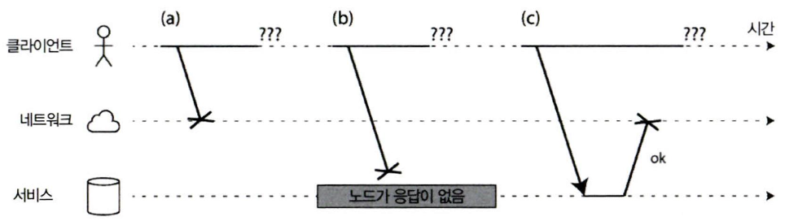

# 8장. 분산 시스템의 골칫거리

## 결함과 부분 장애

---

- 단일 컴퓨터의 결함은 결정적(deterministic)
    - 하드웨어 이상이 없으면 항상 같은 결과를 내며, 문제 발생 시 완전히 멈추는 형태로 설계됨 (잘못된 결과 대신 크래시)
- 분산 시스템의 결함은 비결정적(nondeterministic)
    - 일부 노드나 네트워크만 실패하는 부분 장애(Partial Failure) 발생
    - 어떤 작업이 성공했는지조차 확실히 알기 어려움
    - 메시지 지연과 전달 실패는 예측 불가능함
- 핵심 요지
    - 분산 시스템은 “언제든 일부가 고장날 수 있다”는 전제에서 출발해야 함
    - 신뢰성은 전제할 수 없으며, 결함 감지·복구·중복 설계가 필수

### 클라우드 컴퓨팅과 슈퍼컴퓨팅

---

- 두 철학의 대비
    - 슈퍼컴퓨팅: 고성능 계산 중심, 노드 하나의 장애가 전체 중단으로 이어짐
    - 클라우드 컴퓨팅: 저비용 상용 서버 기반, 일부 장애에도 서비스 지속 가능
- 결함 처리 방식
    - 슈퍼컴퓨터: 주기적 체크포인트 후 전체 재시작
    - 클라우드: 장애 노드만 교체, 서비스 중단 최소화
- 네트워크 구조
    - 슈퍼컴퓨터: 고신뢰 전용망 (RDMA, mesh/torus 구조)
    - 클라우드: 범용 IP 네트워크 (더 느리고 불안정함)
- 운영 관점 핵심
    - 시스템 규모가 커질수록 항상 일부는 고장 상태일 가능성 높음
    - 따라서 부분 장애를 전제로 한 복원력(Resilience) 설계가 필수
    - 신뢰성 없는 구성 요소로부터 신뢰성 있는 시스템을 만드는 것이 목표

## 신뢰성 없는 네트워크

---

- 분산 시스템의 기본 가정: 대부분의 분산 시스템은 비공유(shared-nothing) 구조로, 각 노드는 자기 메모리와 디스크만 사용하며 네트워크를 통해서만 통신한다.
    - 네트워크는 이 장치들 간의 유일한 연결 수단이자 잠재적 장애 지점이다.

- 비동기 패킷 네트워크의 특성: 메시지가 언제 도착할지, 혹은 도착할지를 보장하지 않는다.
    - 인터넷과 데이터센터 네트워크 대부분은 비동기 패킷 네트워크이다.

- 요청–응답 과정에서 일어날 수 있는 문제들:
    1. 요청이 손실됨 (케이블 불량 등)
    2. 큐에 지연되어 늦게 도착
    3. 원격 노드가 다운됨
    4. GC 등으로 일시 응답 중단
    5. 요청은 처리되었으나 응답이 손실
    6. 응답은 존재하지만 네트워크 지연으로 늦게 도착
    
    
    
    그림 8-1. 요청을 보낸 후 응답을 받지 못했다면 (a) 요청이 손실됐는지, (b) 원격 노드가 다운됐는지, (c) 응답이 손실됐는지 구별할 수 없다. 
    
    ❗응답을 받지 못했을 때 요청이 손실된 것인지, 응답이 손실된 것인지, 노드가 죽었는지 구분 불가하다.
    
    → 즉, “응답이 없음”은 원인을 알 수 없다는 뜻이다.
    

### 현실의 네트워크 결함

---

- 현실에서도 결함은 매우 빈번함. 수십 년간 네트워크를 발전시켜 왔지만, 여전히 완전한 신뢰성은 확보되지 않았다.
    - 실제 데이터센터 연구 결과:
        - 한 중형 데이터센터에서 월 평균 12건의 네트워크 결함 발생, 그중 절반은 랙 전체 연결 단절
        - 스위치·로드 밸런서 등 핵심 장비의 장애도 잦음
        - 장비를 이중화(redundancy)해도 사람의 실수(설정 오류 등)는 막지 못함
        - EC2 같은 퍼블릭 클라우드는 특히 짧은 단절(transient failure) 이 자주 발생.
    - 네트워크 링크는 한 방향으로만 잘 작동하고 반대 방향은 끊길 수도 있음 (즉, 패킷 송신은 되지만 수신은 안 되는 경우 존재)

### 결함 감지

---

- 시스템은 자동으로 장애 노드를 감지해야 함
    - 로드밸런서는 죽은 노드로 요청을 보내지 않음
    - 리더 장애 시 팔로워를 리더로 승격해야 함

- 하지만 감지는 어렵다.
    - 네트워크 지연과 불확실성 때문에 노드가 정말 죽었는지, 단지 느린 것인지 구분이 안 된다.
    - 일부 피드백 예시:
        - OS가 TCP 연결 거절(`RST`, `FIN`)을 반환
        - 프로세스는 죽었지만 OS는 살아있어 스크립트가 알림 가능 (HBase 예시)
        - 스위치 인터페이스에서 하드웨어 링크 장애 감지
        - 라우터가 “도달 불가(ICMP Destination Unreachable)” 메시지 반환

- 그러나 근본적으로는 불확실: TCP가 패킷 전송을 확인하더라도, 애플리케이션이 처리하기 전 죽었을 수 있다.
    
    → 진짜 성공 여부는 애플리케이션 레벨의 응답으로만 보장된다.
    

### 타임아웃과 기약 없는 지연

---

- 타임아웃(timeout) 은 유일한 현실적 방법이지만, 완벽한 기준은 없다.
    - 타임아웃이 길면: 장애 감지가 늦음 → 사용자 대기 증가
    - 타임아웃이 짧으면: 일시적 지연을 장애로 오인 → 불필요한 노드 교체

- 잘못된 장애 판정 문제: 노드가 실제로 살아 있는데 죽었다고 선언하면, 다른 노드가 동일 작업을 반복 수행해 중복 처리나 부하 전이가 발생할 수 있다.

- 이론적 가정(이상적 네트워크):
    - 모든 패킷은 최대 `d` 시간 내 도착하거나 손실됨
    - 장애 없는 노드는 `r` 시간 내 요청 처리
        
        → 따라서 응답은 `2d + r` 시간 내 도착해야 함
        
- 현실: 실제 네트워크는 기약 없는 지연(unbounded delay) 을 가진다.
    - 전송 지연에 상한이 없음, 일시적 왕복 시간(RTT) 상승만으로도 시스템 균형이 깨질 수 있다.
    - 따라서 “짧은 타임아웃으로 빠르게 감지”하는 전략은 오히려 불안정성을 초래한다.

- 네트워크 혼잡과 큐 대기
    - 네트워크에서 패킷 지연의 주된 원인은 대부분 큐 대기(queueing) 때문이다.
        - 여러 노드가 동시에 같은 목적지로 패킷을 보낼 때, 네트워크 스위치는 이를 큐에 저장했다가 순차적으로 전송한다.
            - 큐에 데이터가 쌓이면 네트워크는 정상 작동 중이라도 패킷이 일시적으로 지연되거나 손실될 수 있다. 큐가 가득 차면 패킷이 버려지고, 송신 측은 손실된 패킷을 재전송해야 한다.
        - 혼잡(network congestion) 은 단순히 링크나 장비의 장애가 아닌, 너무 많은 데이터가 동시에 몰릴 때 발생하는 구조적 현상이다.
    - 목적지 노드에서도 큐 대기가 발생할 수 있다.
        - ex> 모든 CPU 코어가 바쁜 상태라면 네트워크에서 받은 요청은 OS 레벨 큐에 잠시 보관되며, 처리 가능한 시점까지 지연된다.
    - 가상 환경(VM) 에서는 CPU를 공유하므로, 한 VM이 멈추면 네트워크에서 받은 데이터가 하이퍼바이저 큐에 쌓이며 지연 변동성이 더 커진다.
    - TCP의 흐름 제어(flow control), 혼잡 회피(congestion avoidance), 배압(backpressure)
        - 송신 노드가 수신 노드의 처리 한계를 넘지 않도록 전송 속도를 스스로 제한하는 방식
            
            → 그러나 이 과정에서도 데이터는 여전히 전송 대기 큐에 머무를 수 있다.
            
        - 결과적으로, 네트워크가 정상 동작 중이라도 큐의 길이에 따라 지연 시간(latency) 은 크게 달라질 수 있다.
    
    
    
    그림 8-2. 여러 장비가 같은 목적지로 네트워크 트래픽을 보내면 스위치 큐가 가득 찰 수 있다. 여기서는 포트 1, 2, 4가 모두 포트 3으로 패킷을 보내려 한다.
    

- TCP 대 UDP
    - TCP
        - 신뢰성 보장(패킷 손실 시 재전송, 순서 보존)
        - 하지만 혼잡 제어와 재전송으로 인해 지연 시간의 변동성 증가
        - 애플리케이션 입장에서는 손실은 보이지 않지만, 재전송 대기 시간으로 인한 지연이 발생함
    - UDP
        - 흐름 제어나 재전송을 수행하지 않음 → 더 일정한 지연 시간
        - 패킷 손실 시 그냥 버림 → 신뢰성 대신 실시간성 우선
        - ex> 화상 회의나 VoIP처럼, 손실된 패킷을 나중에 받아도 의미가 없는 경우에 적합
    
    → TCP는 정확성을, UDP는 예측 가능한 지연과 낮은 변동성을 추구한다.
    

- 타임아웃의 결정 (Timeout Selection)
    - 이런 환경에서는 이론적으로 올바른 타임아웃 값이 존재하지 않는다.
    - 현실적인 방법은 실험 기반 측정이다.
        - 네트워크 왕복 시간(RTT) 분포를 장기간 관찰해 지연의 범위를 파악
        - 애플리케이션 특성(실시간성, 내결함성 등)을 고려해, 오탐(잘못된 장애 판정) 과 지연 감내 사이의 균형점을 설정한다.
    - 정적 타임아웃보다, 지연 분포(jitter)에 따라 동적으로 조정되는 타임아웃이 바람직하다.

### 동기 네트워크 대 비동기 네트워크

---

- 이상적 가정: 네트워크가 일정한 최대 지연 시간 내에 항상 패킷을 전달하고, 손실되지 않는다면 분산 시스템은 훨씬 단순해질 것이다.
    
    → 즉, 하드웨어 수준에서 “예측 가능한 네트워크”를 구현할 수 있다면 좋겠지만, 현실은 다르다.
    

- 동기 네트워크 (Synchronous Network)
    - 전화망(circuit-switched network) 구조 - 통화가 시작되면 두 단말 사이의 전체 경로에 고정된 대역폭이 예약된다.
    - 통화가 끝날 때까지 동일한 대역폭이 유지되며, 큐 대기 없음
    - 네트워크 전체 지연의 최대값이 고정(bound delay) 되어 있음
    - ex> ISDN, 전용 회선, 음성 회선망
- 비동기 네트워크 (Asynchronous Network)
    - 패킷 교환(packet-switched) 기반 - 인터넷, 데이터센터 네트워크, TCP/IP
    - 회선을 미리 예약하지 않으며, 가능한 한 빨리 데이터를 전송함
    - 여러 노드가 경쟁적으로 링크를 공유하므로 큐 대기 발생 가능
    - 지연에 상한이 없고, 네트워크 부하에 따라 RTT가 크게 변동한다.
    - 효율성(자원 활용률)은 높지만, 예측 가능성은 낮다.

- 그냥 네트워크 지연을 예측 가능하게 만들 수는 없을까?
    - 전화망(회선 교환) 은 신뢰성과 지연 예측성이 매우 높지만, 데이터 네트워크(패킷 교환) 은 “순간적으로 몰리는 트래픽(bursty traffic)”을 처리하기 위해 설계됐다.
    - 회선 교환의 한계
        - 고정된 대역폭을 미리 할당해야 하므로, 실제 사용량보다 낮게 잡으면 비효율적이고, 높게 잡으면 회선 생성 자체가 불가능
        - 즉, 대역폭 추정의 어려움 때문에 웹·이메일·파일 전송 같은 변동성 큰 트래픽에는 부적합
    - 패킷 교환의 장점
        - 전송량을 실시간으로 조정하며 네트워크 용량을 최대한 활용
        - 사용하지 않을 때는 자원을 점유하지 않음 (TCP 연결이 유휴 상태일 때 대역폭 사용 0)
        - 효율성과 비용 면에서 훨씬 우수하지만, 지연 예측성은 떨어짐
    - 하이브리드 접근
        - ATM, InfiniBand 등은 회선 교환과 패킷 교환을 결합
        - 링크 단위의 흐름 제어(flow control) 와 QoS (Quality of Service), 전송 제한(admission control) 로 통계적으로 제한된 지연을 제공할 수 있음
        - 그러나 공용 클라우드나 인터넷 환경에서는 이런 기능을 실제로 활용할 수 없음
    
    👉 네트워크 지연의 불규칙성은 자연 법칙이 아니라 비용–효율 트레이드오프의 결과다.
    
    - 고정된 지연(예측 가능성)을 원하면 → 전용 자원과 높은 비용 필요
    - 변동 지연(비예측성)을 감수하면 → 높은 활용률과 낮은 비용을 얻을 수 있다.

## 신뢰성 없는 시계

---

- 시계의 역할과 의존성
    - 분산 시스템에서 애플리케이션은 다양한 시간 관련 질문에 의존한다.
        - ex> 요청의 타임아웃, 서비스 응답 시간, 초당 처리량, 사용자의 체류 시간, 게시물 시각, 캐시 만료 시점, 로그 타임스탬프 등
        
        → 일부는 지속 시간(duration), 일부는 특정 시점(point in time) 을 측정
        

- 분산 환경에서의 시간 불확실성
    - 메시지는 즉시 전달되지 않으며, 네트워크 지연으로 전송·수신 시점이 불확실하다.
    - 지연이 일정하지 않아 이벤트 순서를 판단하기 어려움
    - 각 장비는 독립된 로컬 시계(quartz oscillator) 를 사용하기 때문에 약간씩 다른 속도로 흐름
    - 시계는 완전히 정확하지 않아, 장비마다 빠르거나 느린 시간 차(drift) 가 존재

- 시계 동기화 방식
    - 일반적으로 NTP(Network Time Protocol) 을 사용해 서버 그룹 기준으로 동기화
    - NTP 서버는 GPS 등의 더 정확한 기준 시계로부터 시간 정보를 얻는다.

### 단조 시계 대 일 기준 시계

---

- 일 기준 시계
    - 현재 날짜와 시각(wall-clock time) 을 반환하는 일반적인 시계
        - ex> Linux의 `clock_gettime(CLOCK_REALTIME)`, Java의 `System.currentTimeMillis()`
    - NTP를 통해 동기화되지만, 다음과 같은 한계 존재:
        - NTP와의 불일치 시 강제 리셋으로 인해 시간이 과거로 점프(backward jump) 할 수 있음
        - 윤초(leap second) 처리 방식이 일관되지 않아 시계가 59초 또는 61초일 때도 있음 → 경과 시간 측정에는 부적합
        - 오래된 시스템은 해상도(coarse-grained)가 낮음 (10ms 단위 등)

- 단조 시계
    - 항상 앞으로만 진행하는 시계, 경과 시간(duration) 측정용
        - ex> Linux의 `clock_gettime(CLOCK_MONOTONIC)`, Java의 `System.nanoTime()`
    - 절대적인 시각을 표현하지 않으며, 시스템 부팅 이후의 상대 시간만 측정
    - CPU마다 타이머가 달라 미세한 차이가 발생할 수 있으나, OS가 이를 보정해 일관성을 유지
    - NTP는 단조 시계 속도를 조절(slewing) 할 수는 있으나, 시간을 뒤로 돌리진 않음
        - 보통 ±0.05% 내에서 속도 조정만 가능

❗단조 시계는 일 기준 시계보다 안정적이며 측정 신뢰도 높음

### 시계 동기화와 정확도

---

- 시계 오차 원인
    - 하드웨어 드리프트(drift): 온도나 부품 특성에 따라 시계가 빨라지거나 느려짐
        - ex> 구글은 서버 드리프트를 200ppm으로 가정 (30초마다 6ms 오차)
    - NTP와의 차이가 커지면 강제 리셋으로 시간이 순간적으로 뒤로 이동하거나 점프할 수 있음
    - 방화벽 등으로 NTP 연결이 차단되면 오랜 시간 동안 오차가 누적될 수 있음
    - 일부 NTP 서버는 설정 오류로 시간대를 잘못 보고하기도 함
    - 윤초(leap second) 로 인한 59초/61초 문제 발생 가능
    - 가상머신(VM) 환경에서는 VM 간 CPU 공유로 인해 수 밀리초 단위의 시간 점프 발생
    - 모바일·임베디드 장치 등은 하드웨어 신뢰성이 낮아 시간 왜곡 가능성 존재

- 정밀한 시계 확보 방법
    - 높은 정확도를 원할 경우 GPS 수신기나 정밀 시간 프로토콜(Precision Time Protocol) 사용
    - 금융권(MiFID II) 규제 예시: 100마이크로초 이내 동기화 요구
    - 그러나 높은 정밀도를 달성하려면 전문 인력, 하드웨어, 지속적 모니터링이 필요함

### 동기화된 시계에 의존하기

---

- 문제점: 시계는 단순해 보이지만 많은 함정이 있다. 👉 소프트웨어는 이를 전제로 설계해야 함
    - 하루가 정확히 86,400초가 아닐 수 있음. 일 기준 시계가 거꾸로 가거나 노드마다 시각이 다를 수 있음
    - 잘못된 시계의 위험
        - CPU나 네트워크가 고장 나면 즉시 인지 가능하지만, 시계 오차는 눈에 띄지 않게 누적됨
        - 쿼츠 드리프트나 잘못된 NTP 설정은 시스템이 멀쩡히 작동하는 것처럼 보여도 시간이 점점 실제와 어긋나게 만든다.
        
        🥲 결과적으로 조용한 데이터 손실(silent data corruption) 이 발생할 수 있음
        
    - 대응 방안
        - 동기화된 시계를 사용하는 시스템에서는 모든 노드의 시계 오프셋(clock offset) 을 모니터링해야 함
        - 시계 차이가 너무 큰 노드는 클러스터에서 격리(제거) 해야 함

- 이벤트 순서화용 타임스탬프
    - 여러 노드에서 동시에 발생한 이벤트의 순서를 결정하는 것은 분산 시스템의 주요 난제다.
        - ex> 두 클라이언트가 분산 DB에 동시에 쓰기를 수행했을 때 “누가 먼저 썼는가?”, “어떤 값이 최신인가?”를 판별해야 함
            
            
            
            그림 8-3. 클라이언트 B는 클라이언트 A보다 인과성 측면에서 나중에 쓰지만 B가 쓸 때 사용하는 타임스탬프가 더 이르다.
            
            - 문제 원인
                - 각 노드는 자신의 일 기준 시계(time-of-day clock) 를 기준으로 타임스탬프를 생성
                - 그러나 시계 간 오차(skew) 가 존재하므로, 실제로 나중에 발생한 이벤트가 더 작은 타임스탬프를 가질 수 있다.
                - 이로 인해 데이터베이스가 잘못된 최신값을 판단하거나 쓰기 손실(loss) 이 발생함
    - 최종 쓰기 승리(Last Write Wins) 전략의 한계
        - 시계가 느린 노드는 빠른 노드의 데이터를 덮어쓰지 못해 데이터 손실 가능
        - 실제로 순차적 발생(A 후 B)이더라도 시계가 뒤바뀌면 인과성 위반 발생
        - 시계 해상도가 낮거나 중복 타임스탬프 발생 시 동시성 판단 불가
    - 정확도 문제
        - NTP로 시계를 동기화해도 네트워크 지연, 패킷 손실, 드리프트 등으로 인해 수십~수백 밀리초 수준의 불확실성이 남는다.
        - 송신 시각 100ms, 수신 시각 99ms처럼 보이는 현상도 가능 → 순서 보장 불가능
    - 논리적 시계(Logical Clock)
        - 물리적 시간 대신 이벤트의 인과 관계(causal order) 를 기록
        - Lamport Clock, Vector Clock 등이 대표적이며, “A가 B보다 먼저 발생했는가”만 판단한다.
        - 물리적 시각의 오차와 무관하게 안정적 순서화 가능

- 시계 읽기는 신뢰 구간이 있다
    - 시스템의 시계는 단일 시점이 아닌 시간 범위(interval) 로 해석해야 한다.
        - ex> “현재 시간은 10.3초~10.5초 사이일 확률이 95%”
    - 불확실성의 원인
        - 하드웨어 드리프트(drift): 온도나 장치 차이로 시계 속도가 변함
        - 네트워크 지연과 NTP 오차: 수 ms~수백 ms까지 변동 가능
        - 미세 단위(마이크로초) 측정이 가능해도 실제 정확도는 ±100ms 수준일 수 있다.
    - 의미
        - 타임스탬프의 미세한 자릿수(예: 42.003초)는 실제로 신뢰할 수 있는 정밀도가 아님.
        - 시계는 정확한 시점(point) 이 아닌 추정 가능한 범위(range) 로 이해해야 한다.
    - 불확실성 계산
        - GPS·원자시계 등은 제조사 제공 오차 범위를 기준으로 계산
        - NTP 서버의 경우, 최근 동기화 이후의 경과 시간·왕복 지연시간을 근사값으로 사용
    - 대부분의 시스템은 이러한 신뢰 구간 정보를 노출하지 않는다.
        - ex> `clock_gettime()`은 오차 범위를 알려주지 않기 때문에 타임스탬프가 ±5ms 오차인지 ±5년 오차인지 알 수 없음
    - 예외: 구글 Spanner의 TrueTime API는 신뢰 구간을 명시적으로 제공함
        
        → `[earliest, latest]` 형태로 반환하여 실제 시각이 이 구간 안에 있음을 보장
        

- 전역 스냅숏용 동기화된 시계
    - 스냅숏 격리(Snapshot Isolation)
        - 읽기 전용 트랜잭션이 특정 시점의 일관된 데이터 상태를 보도록 하는 기능
            - 잠금을 사용하지 않고 일관성 있는 읽기를 제공
        - 단일 노드에서는 단순 카운터로 트랜잭션 ID를 순차 부여 가능
            - 그러나 다중 데이터센터에 걸친 분산 환경에서는 전역 단조 증가 트랜잭션 ID 생성이 어려움
            - 트랜잭션 간 인과 관계(causality) 를 반영해야 하기 때문
    - 구글 스패너(Spanner)의 접근법
        - TrueTime API를 통해 각 노드의 시계 신뢰 구간(confidence interval) 을 활용
            - 각 트랜잭션의 타임스탬프 범위를 `[earliest, latest]` 로 표현
            - 두 구간이 겹치지 않으면 확실히 A → B 순서로 발생했다고 판단 가능
            - 겹칠 경우 순서가 불확실하므로, 일정 시간(신뢰 구간 길이만큼 대기) 후 커밋 수행
        - 스패너는 GPS 수신기나 원자 시계를 데이터센터마다 배치해 시계 불확실성을 약 ±7ms 이내로 유지
            - 이로써 트랜잭션 간 인과성을 보장하면서도 높은 처리량을 달성
            - 다만 이러한 방식은 매우 고가의 하드웨어와 정밀한 운영 관리를 필요로 함
    
    → 시계 동기화를 이용한 분산 트랜잭션 일관성은 활발한 연구 분야지만, 아직 구글 외에는 구현 사례가 없다.
    

### 프로세스 중단

---

- 분산 시스템에서 리더 노드가 임차권(lease) 을 기반으로 리더십을 유지하는 경우, 시계에 의존하는 방식은 위험하다.
    - ex> 리더가 임차권 만료 시간을 로컬 시계로 계산할 때 시계 오차가 발생하면, 이미 리더가 아닌 노드가 여전히 요청을 처리할 수 있다.
- 문제 코드 예시
    
    ```java
    while (true) {
        request = getIncomingRequest();
        
        // 항상 임차권이 적어도 10초는 남아 있게 보장한다.
        if (lease.expiryTimeMillis - System.currentTimeMillis() < 10000)
            lease = lease.renew();
    
        if (lease.isValid())
            process(request);
    }
    ```
    
- 동기화된 시계에 의존 → 시계가 불일치하면 임차권 만료 계산 오류 발생
    
    😃 단조 시계만 사용하도록 프로토콜을 수정한다.
    
- 그러나 스레드 중단이 발생하면, `lease.isValid()` 검사 시 이미 리더가 바뀐 뒤일 수 있음
    - 중단(pauses)이 발생하는 이유
        1. 가비지 컬렉션(GC) 중단: stop-the-world GC가 모든 스레드를 멈춤. 수 분까지 지속 가능
        2. 가상화 환경의 서스펜드(suspend): VM이 중단 후 디스크에 저장되고 재개될 수 있음. 라이브 마이그레이션 시 발생
        3. 노트북 절전/재개: 유저가 덮개를 닫을 때 발생
        4. 스케줄링 지연: OS나 하이퍼바이저의 컨텍스트 스위치로 인한 스틸 타임(steal time)
        5. 동기식 I/O 대기: 느린 디스크나 네트워크 파일시스템(EBS 등)에 접근 시 중단
        6. 페이징(paging): 메모리 부족 시 페이지 스왑 발생 → 스레드가 중단될 수 있음
        7. `SIGSTOP` 신호: 수동 또는 실수로 프로세스가 중단될 수 있음
    
    👉 실행 중인 스레드가 언제든 중단되고 재개될 수 있으며, 재개 시점에는 외부 세계가 이미 변해 있을 수 있음 (ex> 리더 교체)
    
    - 분산 시스템의 노드는 언제든 멈췄다가 재개될 수 있다고 가정해야 한다.
    - 외부에서는 해당 노드를 응답하지 않는다고 판단해 죽었다고 선언할 수도 있다.

- 응답 시간 보장
    - 대부분의 시스템은 스레드나 프로세스가 예측 불가능한 시간 동안 중단될 수 있음을 전제로 설계되어 있다. 이를 완전히 제거하려면 실시간(real-time) 시스템이 필요하다.
    - 실시간 시스템(Real-Time System)
        - 특정 작업이 정해진 시간 안(deadline) 에 반드시 완료되어야 하는 시스템
        - 실패 시 심각한 결과 초래 가능 → 항공기 제어, 로켓, 자동차, 로봇 등에서 사용
    - 필요 조건
        1. 실시간 운영체제(RTOS): CPU 시간을 보장된 주기로 분배
        2. 정적 메모리 할당: 런타임 메모리 할당 제한 또는 금지
        3. 예측 가능한 GC 또는 GC 제거: 불규칙한 stop-the-world를 없애야 함
        4. 철저한 테스트와 검증: 각 함수의 최악 실행 시간(WCET)을 문서화해야 함
    - 비용과 한계
        - 높은 비용, 제한된 언어·도구만 사용 가능
        - 일반 서버나 데이터 처리 시스템에는 경제성·적용성 모두 낮음
        - 따라서 대부분의 분산 시스템은 비실시간 환경에서 운영되며, 중단이나 스케줄링 불안정성에 노출될 수밖에 없다.

- 가비지 컬렉션의 영향을 제한하기
    - GC 중단은 스케줄링 지연과 응답 시간 변동을 유발한다.
    - 완화 전략
        1. GC를 계획된 중단으로 취급
            - GC 중단을 “노드 일시적 장애”로 간주하고, 다른 노드가 해당 노드의 요청을 대신 처리하도록 함
            - 런타임이 GC 시점을 애플리케이션에 미리 알리면, 새 요청을 중단하고 남은 요청을 처리한 후 GC 실행 가능
            
            → 클라이언트 입장에서 GC 중단이 투명해짐
            
        2. 짧은 객체 중심의 GC 사용
            - 수명이 짧은 객체만 자주 수집하고, 장기 객체는 누적되기 전에 프로세스 재시작으로 정리
            - ex> 한 번에 하나의 노드만 재시작하고 트래픽을 다른 노드로 분산
    
    👉 GC 중단을 완전히 없앨 수는 없지만, 응답 시간 상위 백분위를 줄여준다.
    
    - 특히 금융 거래처럼 지연에 민감한 시스템에서 유용하게 사용된다.

## 지식, 진실, 그리고 거짓말

---

- 문제 배경: 신뢰할 수 없는 통신과 부분 지식
    - 단일 컴퓨터 환경에서는 모든 연산이 하나의 메모리와 CPU 안에서 실행되므로 상태(state)와 시간 순서(order)가 명확하게 정의된다.
    - 분산 시스템에서는 각 노드가 독립된 메모리와 시계를 가지며, 서로 통신하는 유일한 수단은 네트워크 메시지다.
        - 하지만 네트워크는 비동기적(asynchronous) 이며, 메시지가 언제 도착할지, 혹은 도착할지를 보장하지 않는다.
    
    → 즉, 한 노드는 “상대 노드가 살아 있는지, 응답이 유실된 것인지, 네트워크가 느린 것인지” 구분할 수 없다.
    
    🥲 이 때문에 각 노드는 자신이 가진 정보만으로 판단해야 하는 ‘불완전한 지식 상태’에 놓인다.
    

### 진실은 다수결로 결정된다

---

- 분산 환경에서는 어떤 노드의 개별적인 인식보다 다수 노드의 합의가 “진실”이 된다.
    - ex> 한 노드가 실제로 정상적으로 동작 중이라도 다른 노드들이 그로부터 응답을 받지 못하면, 다수는 그 노드를 “죽었다(dead)” 고 판단하고 시스템은 그 판단에 따라 동작한다.
        
        → 비대칭 장애(asymmetric fault): 송신은 가능하지만 수신이 불가능한 경우 자주 발생한다.
        

- 리더와 잠금
    - 분산 시스템에서는 여러 노드 중 하나를 리더(leader)로 선택하거나, 특정 자원(Resource)에 대한 잠금(lock) 을 설정해야 하는 상황이 많다.
        - ex>
            - 하나의 파티션당 리더 노드 1개만 존재해야 함
            - 하나의 사용자 이름(username)은 한 번만 등록 가능해야 함
            - 하나의 파일은 한 클라이언트만 접근할 수 있어야 함
    - 이때 문제가 발생한다:
        - 리더 노드가 멈췄거나 네트워크로 분리되었는데 아직 자신이 리더라고 ‘착각’하고 요청을 처리할 수 있다. 다른 노드들은 이미 새 리더를 선출했을 수도 있다.
    - 이런 충돌은 데이터 손상이나 “이중 리더(Split-Brain)” 문제로 이어질 수 있다.

- 펜싱 토큰
    - 누가 현재 유효한 리더인지 식별할 수 있는 단조 증가하는 숫자(토큰)
    
    
    
    그림 8-5. 펜싱 토큰이 증가하는 순서에 맞는 쓰기만 허용함으로써 저장소에 대한 접근을 안전하게 만들기
    
    | 클라이언트 | 토큰 | 상태 |
    | --- | --- | --- |
    | Client 1 | 33 | 리더 역할 수행 중, 하지만 GC로 중단됨 |
    | Client 2 | 34 | 새로 리더가 됨 |
    | Client 1 (복귀) | 33 | 쓰기 요청 시도 → 거부됨 (토큰 33 < 34) |
    - 원리
        - 잠금 서비스(혹은 리더 선출 서비스)는 잠금이 승인될 때마다 단조 증가하는 번호(토큰) 를 발급한다.
        - 클라이언트는 리소스에 접근할 때 자신의 현재 토큰을 함께 제출해야 한다.
        - 리소스(ex> 파일 스토리지)는 이전보다 낮은 토큰 번호의 요청을 거부함으로써 이미 만료된(혹은 잘못된) 리더나 클라이언트의 접근을 차단한다.
    
    😀 이 방식으로 “잘못된 리더”의 쓰기나 명령이 시스템을 오염시키는 것을 방지할 수 있다.
    
    > 주키퍼에서는 `zxid` 혹은 `version` 필드가 이런 펜싱 토큰 역할을 한다.
    > 
    - Elasticsearch
        
        
        | 항목 | `_version` | `_primary_term + _seq_no` | 펜싱 토큰 |
        | --- | --- | --- | --- |
        | 관리 단위 | 문서(document) 단위 | 샤드(shard) 단위 | 락 단위 |
        | 용도 | 낙관적 갱신 제어 (버전 충돌 방지) | 리더 교체 후 안전한 쓰기 순서 보장 | 오래된 리더/요청 차단 |
        | 증가 조건 | 문서 수정 시 | 리더 교체 및 쓰기 발생 시 | 새로운 lease 발급 시 |
        | 검증 주체 | 클라이언트 | 서버 | 서버 |
        | Elasticsearch 내 위치 | 사용자 API에서 사용 가능 | 내부 트랜잭션 레벨에서 관리 | (개념적 대응) |
        - `_version`: 문서가 몇 번째로 수정되었는가 나타내는 로컬 수준의 버전 관리 필드
        - `_seq_no`: 쓰기 순서를 추적해 복제 시 일관성을 맞추는 내부용 필드
        - `_primary_term`: 리더 교체 시마다 증가하는 글로벌 lease 번호
        - `_seq_no`+`_primary_term`: 오래된 리더의 쓰기나 중복 쓰기를 완전히 차단할 수 있음
    - MongoDB
        - MongoDB Replica Set에서는 **선거(Election)** 를 통해 Primary를 결정한다.
        
        | 항목 | 설명 | 펜싱 토큰과의 관계 |
        | --- | --- | --- |
        | `Election Term` | 리더 선출 시마다 증가하는 단조 증가 값 | 펜싱 토큰(Fencing Token) 역할 |
        | `OpTime` | 각 쓰기 연산의 시점(Write Timestamp) | term 내의 쓰기 순서를 나타냄 |
        | (`term`, `OpTime`) | Primary의 “임기와 시점”을 조합한 전역적 쓰기 식별자 | term이 바뀌면 이전 리더의 쓰기 무효화 |
    
    | 항목 | Elasticsearch | MongoDB | Raft / ZooKeeper |
    | --- | --- | --- | --- |
    | 펜싱 단위 | `_primary_term` (샤드 단위) | `Election Term` (Replica Set 단위) | `term` / `zxid` |
    | 증가 시점 | 리더(Primary shard) 교체 시 | Primary 교체 시 | 리더 교체 시 |
    | 쓰기 단위 구분 | `_seq_no` | `opTime` | `log index` |
    | 오래된 리더 차단 | term 비교로 쓰기 거부 | term 비교로 oplog 무효화 | term 비교로 append 거부 |
    | 결과 | 동일 term 내에서는 순서 보장, term 교체 시 이전 리더 무효 | 동일 term 내에서는 순서 보장, 새 term 시 이전 Primary 무효 | 동일 |

### 비잔틴 결함

---

- 펜싱 토큰은 실수(오류)로 잘못된 행동을 하는 노드(예: 만료 사실을 모르는 노드)는 막을 수 있다.
    - 하지만 고의적으로 거짓 메시지를 보내는 노드는 막을 수 없다.

- 비잔틴 결함(Byzantine Fault): 노드가 의도적으로 거짓 정보를 퍼뜨리거나, 네트워크 메시지를 조작할 수 있는 상황
    - 비잔틴 결함이 존재하는 환경에서는 다수결만으로는 신뢰할 수 없으며, 이 문제는 비잔틴 장군 문제(Byzantine Generals Problem) 로 알려져 있다.
    - 금융/블록체인 네트워크: 일부 참여자가 의도적으로 거짓 데이터를 보내거나 거래를 조작할 수 있음
        
        → 이런 환경에서는 정직하지 않은 노드도 고려해야 하므로 BFT가 필요
        

- 약한 형태의 거짓말
    - 완전한 비잔틴 내결함성은 아니지만, 일반적인 분산 시스템에서는 다음과 같은 “약한 방어 메커니즘”으로 충분히 실용적인 신뢰성을 확보한다.
    
    | 문제 유형 | 대응 메커니즘 |
    | --- | --- |
    | 하드웨어 오류, 손상된 패킷 | TCP/UDP 체크섬, 애플리케이션 레벨 프로토콜 검증 |
    | 잘못된 입력값 | 입력 검증(Input validation) + 출력 이스케이프(Output escaping) |
    | 악성 클라이언트 | 인증, 접근 제어, 방화벽 |
    | 잘못된 시계 동기화 | 여러 NTP 서버와 비교해 이상값(outlier) 제외 |
    
    → 즉, “악의적 노드”보다는 일반적인 결함·버그·잘못된 입력을 방지하는 방어적 설계가 주된 전략이다.
    

### 시스템 모델과 현실

---

- 분산 시스템 알고리즘은 현실적 제약을 수학적으로 단순화한 시스템 모델(system model) 가정 위에서 설계된다.
- 핵심은 시간(타이밍) 과 노드 장애 형태를 어떻게 가정하느냐이다.

- 시간 모델
    
    
    | 모델 | 설명 | 현실 적용 |
    | --- | --- | --- |
    | 동기식(Synchronous) | 네트워크 지연·프로세스 중단·시계 오차가 모두 유한 범위 내 | 현실적이지 않음 (이상적 가정) |
    | 부분 동기식(Partially Synchronous) | 대부분의 시간엔 정상, 간헐적으로 지연 발생 | 가장 현실적인 모델 |
    | 비동기식(Asynchronous) | 지연이나 시계 오차에 상한 없음 | 현실성 낮음, 이론적 모델 |
    
    → 대부분의 실제 분산 시스템은 “부분 동기식 + 장애 복구형” 모델을 따른다.
    

- 노드 장애 모델
    
    
    | 모델 | 설명 |
    | --- | --- |
    | Crash-stop | 노드가 한 번 죽으면 다시 돌아오지 않음 |
    | Crash-recovery | 죽었다가 일정 시간이 지나 다시 복구될 수 있음 |
    | Byzantine | 노드가 거짓 응답·악의적 메시지를 보냄 (비정상적 동작 포함) |
    
    → 현실적 시스템은 “부분 동기식 + Crash-recovery” 조합으로 모델링하는 경우가 가장 많다.
    

- 알고리즘의 정확성
    - 정합성: 알고리즘이 “정확하게 동작한다”는 것은 명시적인 속성을 만족한다는 뜻
    - ex> 펜싱 토큰 생성 알고리즘의 정합성 속성
        - Uniqueness : 같은 토큰이 두 번 발급되지 않는다.
        - Monotonic Sequence : 요청이 완료된 순서대로 토큰이 증가한다.
        - Availability : 요청이 성공하면 반드시 응답을 받는다.

- 안전성과 활동성
    
    
    | 구분 | 의미 | 예시 |
    | --- | --- | --- |
    | 안전성(Safety) | “나쁜 일은 절대 일어나지 않는다” | 중복 토큰이 발급되지 않는다 |
    | 활동성(Liveness) | “좋은 일은 언젠가 일어난다” | 요청한 토큰은 결국 발급된다 (eventually) |
    - 안전성 위반: 즉시 관찰 가능하며 되돌릴 수 없다.
    - 활동성 위반: 일시적 정지일 뿐, 나중에 회복될 수도 있다.
    
    → 분산 알고리즘은 두 속성의 균형을 추구해야 하며, 특히 “부분 동기식 + Crash-recovery” 환경에서는 일시적 정지 후 eventual consistency가 흔한 패턴이다.
    

- 시스템 모델을 현실 세계에 대응시키기
    - 이론적으로 제시되는 분산 시스템 모델(동기식, 비동기식, crash-stop 등)은 현실 세계의 복잡성과 불확실성을 단순화한 추상 모델이다.
        - 하지만 실제 구현에서는 이 단순화된 가정들이 언제든 깨질 수 있다.
            
            
            | 구분 | 이론적 모델 | 현실의 문제점 |
            | --- | --- | --- |
            | Crash-recovery 가정 | 저장 장치의 데이터는 장애 후에도 안전하게 유지됨 | 디스크 오류, 펌웨어 버그 등으로 데이터 손실 가능 |
            | Quorum 알고리즘 | 모든 노드가 과거 저장한 데이터를 정확히 기억함 | 일부 노드가 “기억상실(amnesia)”로 과거 데이터 잊을 수 있음 |
            | Fault 가정 | “발생하지 않는다”고 가정한 오류는 무시 | 실제 시스템에서는 “불가능하다고 가정한 일”이 종종 일어남 |
    - 불가능한 일을 다루는 현실적 접근
        - 어떤 가정이 깨졌을 때, 시스템이 무너지는 대신 복구 가능한 상태로 정리(cleanup) 해야 함 → 운영자가 수동으로 개입해 정리해야 하는 상황
        - 이는 컴퓨터 과학(이론)과 소프트웨어 공학(현실 구현)의 차이를 보여준다.
        
        ❗모든 것은 언젠가 실패한다. 이론적 모델은 설계의 가이드라인일 뿐, 완벽한 현실 대응책은 아니다.
        
    - 알고리즘 검증과 실제 구현의 관계
        - 이론적 검증(correctness proof) 은 시스템의 기본 동작 원리를 수학적으로 보장하지만, 실제 구현 시 발생할 수 있는 버그나 환경적 결함은 막지 못한다.
        - 반대로 실험적 검증(empirical testing) 은 현실 환경에서의 문제를 찾을 수 있으나, 수학적 완전성을 증명하지는 않는다.
        - 따라서 이론적 분석 + 실험적 검증을 함께 수행해야 한다.

## 정리

---

1. 네트워크 신뢰성의 한계
    - 패킷은 손실될 수도, 지연될 수도 있다.
    - 응답이 없다고 해서 요청이 실패했는지, 노드가 죽었는지 구분 불가
2. 시계(clock) 불일치
    - 노드별 시계는 항상 오차가 있으며, NTP 동기화로도 완전한 일치를 보장할 수 없음
3. 프로세스 중단
    - stop-the-world GC 같은 이벤트로 노드가 수 초간 정지할 수 있고, 다른 노드 입장에서는 “죽은 것처럼” 보일 수 있음

💡 핵심 결론: 부분 실패(Partial Failure)는 필연적이다

> “분산 시스템의 본질은 부분 실패이다.”
> 
- 어떤 노드는 정상인데, 다른 노드는 느려지거나 응답이 없는 상황이 항상 존재할 수 있다.
- 네트워크, 디스크, 하드웨어, 시계 등 다양한 계층에서 이러한 부분 실패가 발생한다.
- 따라서 시스템 전체가 중단되지 않고 일부 장애 속에서도 계속 동작할 수 있도록 설계해야 한다. (Fault Tolerance)

| 목표 | 현실적 한계 |
| --- | --- |
| 실시간 응답 보장 | 매우 높은 비용과 낮은 하드웨어 효율 |
| 절대적 신뢰성 | 모든 장애를 예방하기 어렵고, 복구 비용이 큼 |
| 비용 효율 | 저렴하고 신뢰성 낮은 구성 요소를 사용해야 함 |

→ 결국 대부분의 분산 시스템은 “완벽한 신뢰성”보다 “저렴하고 견딜 수 있는 불완전성”을 선택한다.
