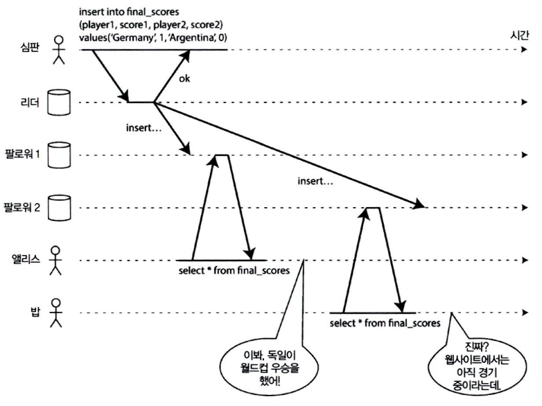

# 9장. 일관성과 합의

## 일관성 보장

---

- 분산 시스템에서는 여러 노드가 동일한 데이터를 복제하여 저장하지만, 네트워크 지연·노드 장애·동기화 시점 차이 등으로 인해 각 노드가 서로 다른 값을 가질 수 있다.
    - 이 문제를 해결하기 위해 “일관성(Consistency)” 이라는 개념이 등장한다.

- 최종적 일관성(Eventual Consistency)
    - 대부분의 복제 데이터베이스는 최종적 일관성을 제공한다.
    - 이는 “시간이 충분히 지나면 모든 복제본이 결국 같은 값으로 수렴한다”는 느슨한 보장이다.
    - 네트워크 단절이나 일시적 불일치가 발생해도, 결국 복구되어 같은 값을 갖게 된다.
        
        → 하지만 “언제” 일관성이 회복되는지는 보장하지 않는다.
        
    - ex> DynamoDB, Cassandra, S3 등은 모두 최종적 일관성 모델을 기반으로 한다.
- 한계
    - 일시적으로 “오래된 값”을 읽을 수 있다.
    - 복제본 간의 동기화 시점이 달라서 다른 노드에서 읽은 결과가 다를 수 있다.
    - 따라서 완전한 신뢰성이 요구되는 시스템에는 부적합하다.

## 선형성

---

- 최종적 일관성보다 강한 보장을 제공하는 일관성 모델로, 모든 읽기·쓰기 연산이 단 하나의 복제본에서 일어난 것처럼 보이게 하는 보장이다.
    - 즉, 어떤 시점에서 쓰기가 성공하면 그 이후의 모든 읽기는 반드시 그 결과를 반영해야 한다.
    - == 원자적 일관성(Atomic Consistency) == 강한 일관성(Strong Consistency) == 즉각 일관성(Immediate Consistency)
- 비선형성의 예시
    
    
    
    그림 9-1. 이 시스템은 비선형이라서 축구팬들을 혼란스럽게 한다.
    
    - 알리스와 밥이 같은 방에서 2014년 월드컵 결승전 결과를 휴대폰으로 확인하고 있다.
    - 알리스의 요청은 이미 “최종 결과가 발표된” 복제본으로 전달되고, 밥의 요청은 “아직 경기 중인” 복제본으로 전달되었다.
    - 결과: 두 사람은 서로 다른 결과(승리 vs 진행 중)를 본다.

### 시스템에 선형성을 부여하는 것은 무엇인가?

---

- 선형성을 달성하는 핵심 아이디어: 시스템에 여러 복제본이 존재하더라도, 마치 하나의 복제본만 있는 것처럼 보이게 만드는 것
    - 단순히 “복제본을 하나처럼 보이게 한다”는 직관만으로는 부족하다.
    - 어떤 요청이 언제 처리되었는지, 그리고 그 시점의 쓰기·읽기 순서가 실제 시간과 일치하도록 보장되어야 한다.
    - 이를 위해 시스템은 다음 두 가지를 수행한다:
        1. 각 연산의 요청 및 응답 시점을 정확히 기록한다.
        2. 그 순서가 실제 시간에 맞게 단일한 선형 순서로 정렬되었는지 검증한다.
    
    → 즉, 선형성을 부여한다는 것은 모든 연산을 “시간상으로 일관된 단일 타임라인” 위에 재배열할 수 있게 만드는 것을 의미한다.
    

- 레지스터 예시
    - 여러 클라이언트(A, B, C)가 같은 키 `x`를 대상으로 읽기(read)·쓰기(write) 요청을 수행
    - 네트워크 지연으로 인해 요청과 응답의 시간은 서로 다름
    
    
    
    그림 9-2. 읽기 요청이 쓰기 요청과 동시에 실행되면 과거의 값을 반환할 수도 있고 새로운 값을 반환할 수도 있다.
    
    
    
    그림 9-3. 읽기가 새로운 값을 반환한 적이 있은 후에는 모든 후속 읽기(같은 클라이언트에서 실행되든 다른 클라이언트에서 실행되든)도 반드시 새로운 값을 반환해야 한다.
    
    
    
    그림 9-4. 읽기와 쓰기의 영향이 나타나는 것으로 보이는 시점을 시각화하기. B의 마지막 읽기는 선형적이지 않다.
    
    - 동작 예
        1. 클라이언트 C가 `x = 1`을 쓰기 시작
        2. 클라이언트 A와 B가 동시에 `x`를 읽음. 쓰기 타이밍에 따라 A는 `0`, B는 `1`을 읽을 수도 있다.
        3. 하지만 한 번이라도 `1`을 읽은 이후에는, 그 이후의 모든 읽기 요청은 반드시 `1`을 반환해야 한다.
        
        → 이것이 바로 선형성 조건이다.
        

- Compare-and-Set (CAS) 연산
    - `CAS(x, old, new)`: “x의 값이 `old`라면 `new`로 변경하라”는 원자적 비교-갱신 연산
    - CAS는 선형성 보장 구현의 핵심 원자 연산이다.
        - 모든 연산이 CAS처럼 시간 순서에 따라 직렬화(serialized) 되어야 선형성이 유지된다.

### 선형성에 기대기

---

- 선형성(linearizability)이 모든 상황에서 필요하지는 않다.
    - 스포츠 경기의 최종 점수 조회 같은 경우, 잠시 결과가 틀려 보여도 실질적인 피해가 없으므로 굳이 강력한 선형성이 필요하지 않다.
    - 그러나 시스템이 여러 노드에서 동시에 일관되게 동작해야 하는 핵심 영역(ex> 결제, 계좌, 재고 등)에서는 선형성이 매우 중요하다.

- 잠금과 리더 선출
    - 단일 리더 복제의 핵심
        - 단일 리더 시스템에서는 여러 노드 중 단 하나만 리더 역할을 해야 한다.
        - 리더는 쓰기 연산을 담당하며, 다른 노드는 복제(replica)만 수행한다.
        - 만약 두 노드가 모두 자신이 리더라고 주장하면 스플릿 브레인(split brain) 문제가 발생한다.
    - 리더 선출과 잠금
        - 리더를 선택하는 대표적 방법은 분산 잠금(distributed lock) 을 이용하는 것이다.
            - 여러 노드가 동시에 잠금 획득을 시도하고, 가장 먼저 성공한 노드가 리더가 된다.
            - 모든 노드는 누가 잠금을 가지고 있는지 합의해야 한다.
        - 이를 구현하기 위한 대표 도구들:
            - Apache 주키퍼, etcd: 합의 알고리즘(Paxos, Raft 등)을 통해 선형성을 가진 잠금을 제공
            - Apache 큐레이터: 주키퍼 상단에서 고수준 API를 제공
            - Oracle RAC: 동일한 디스크를 공유하는 환경에서 디스크 수준 잠금을 통해 리더를 보장
    
- 제약 조건과 유일성 보장
    - 유일성 제약 조건(Unique Constraints)
        - 동일한 사용자명, 이메일 등은 중복될 수 없도록 보장해야 한다.
            
            → 이런 제약 조건을 강제하려면 선형성이 필요하다.
            
    - 실제 잠금 예시
        - 은행 계좌 잔고, 재고 수량, 좌석 예약 등도 동일한 최신 값 동기화를 필요로 한다.
            - 모든 노드가 “하나의 최신 상태”에 동의해야 함
    - 그러나 실제 애플리케이션에서는 이런 제약을 느슨하게 처리하는 경우도 많다.
        - ex> 항공사 예약 초과 시 보상 제공
    
    ❗따라서 모든 시스템이 선형성을 필요로 하는 것은 아니다. 다만 관계형 DB의 유일성 제약 조건은 여전히 선형성이 요구된다.
    

- 채널 간 타이밍 의존성
    - 서로 다른 통신 경로(채널) 사이의 타이밍 차이로 인해 경쟁 조건(race condition) 이 발생할 수 있다.
        
        → ex> 웹 서버와 파일 저장소가 별도의 채널로 메시지를 주고받는 경우
        
        
        
        그림 9-5. 웹 서버와 이미지 크기 변경 모듈은 파일 저장소와 메시지 큐를 모두 써서 통신하므로 경쟁 조건이 발생할 가능성이 열려 있다.
        
    - 만약 이미지 원본과 썸네일 생성 요청이 서로 다른 타이밍으로 전달되면, 이전 버전의 이미지가 최신 이미지로 덮어쓰이거나 불일치 상태가 생길 수 있다.
    - 해결책: 불필요한 통신 채널을 줄이거나, 큐 기반 비동기 처리 대신 파일 저장소가 업데이트 완료 후 알림 방식으로 대안 구현 가능

### 선형성 시스템 구현하기

---

- 선형성을 제공하는 시스템을 구현하려면 복제 전략이 핵심이다.
    - 데이터 복제본이 여러 개 존재하더라도, 사용자는 항상 단일 복제본처럼 보이게 해야 한다.
- 단일 리더 복제
    - 선형성 달성이 상대적으로 용이.
    - 단일 리더가 쓰기를 담당하고 팔로워가 복제
    - 하지만 리더 장애 시 복구 과정에서 일시적 비선형성 발생 가능.
- 합의 알고리즘 (Paxos, Raft)
    - 단일 리더 복제를 합의 기반으로 구현해 선형성 보장 강화.
    - ex> ZooKeeper, etcd, Consul 등은 이 알고리즘 사용.
- 다중 리더 복제 (비선형적)
    - 여러 노드가 동시에 쓰기를 수행하므로 선형성 보장 불가능.
    - 충돌 해결이 필요하며, 단일 타임라인 유지가 어렵다.
- 리더 없는 복제
    - Dynamo 스타일 시스템.
    - “정족수 합의(quorum)”로 일관성 확보 시도.
    - 하지만 시계 오차(clock skew)로 인해 선형성이 깨질 수 있다.

- 선형성과 정족수 (Quorum)
    
    
    
    그림 9-6. 엄격한 정족수를 사용하지만 비선형적인 실행
    
    - `n`개의 복제본 중 `w`개 쓰기, `r`개 읽기 시, `w + r > n`이면 최신 데이터를 읽을 가능성이 높다.
    - 그러나 동시에 쓰기와 읽기가 겹치면 여전히 비선형적 결과가 발생할 수 있다.
    - 따라서 정족수 조건은 선형성의 충분조건이 아님.
    - Dynamo, Cassandra 같은 시스템은 정족수를 사용하지만 선형성을 완전히 보장하지 않는다.

### 선형성의 비용

---

- 네트워크 단절 상황에서의 트레이드오프
    
    
    
    그림 9-7. 네트워크가 끊기면 선형성과 가용성 사이에서 선택해야만 한다.
    
    - 두 데이터센터 간 네트워크가 끊기면, 각 센터는 독립적으로 동작하지만 서로 데이터를 동기화할 수 없다.
    - 단일 리더 복제의 경우, 네트워크 분리 시 팔로워는 쓰기를 멈추고 대기해야 한다.
    - 반면 다중 리더 복제는 두 센터가 독립적으로 쓰기를 계속하지만, 나중에 충돌 해결이 필요하다.

- CAP 정리
    
    > 일관성(Consistency) – 가용성(Availability) – 분단 내성(Partition Tolerance)
    > 
    - 세 가지 중 동시에 만족할 수 있는 것은 둘뿐이다.

- 선형성과 네트워크 지연
    - 네트워크 분리가 발생했을 때 시스템은
        - 일관성(Consistency)을 유지하거나
        - 가용성(Availability)을 유지할 수는 있지만,
        
        → 둘 다는 불가능하다.
        
    - 현실적 관점
        - 완벽한 CAP 트리플 밸런스는 불가능하다.
        - 실제 분산 시스템은 성능과 내결함성의 균형을 선택해야 한다.
        - ex> NoSQL 시스템은 대부분 “가용성”을 택해 일부 일관성을 포기한다.

## 순서화 보장

---

- 순서화(ordering)는 분산 시스템에서 연산들이 어떤 순서로 실행되었는지 일관되게 인식할 수 있도록 보장하는 개념이다.
    - 이는 선형성(linearizability), 인과성(causality), 그리고 전체 순서(total order)와 밀접히 관련된다.
- 시스템의 신뢰성과 일관성, 특히 트랜잭션 충돌 방지나 이벤트 처리 순서 보장에 핵심적인 역할을 한다.

### 순서화와 인과성

---

- 인과성(Causality)의 핵심 개념
    - 인과성은 “원인과 결과의 관계”를 말한다.
    - 한 연산이 다른 연산보다 먼저 일어나야 하는 이유(즉, 의존 관계)를 나타낸다.
    - ex> 메시지를 보낸 후 응답을 받는 것처럼, 응답은 반드시 원인(요청) 이후에 발생해야 한다.

- 인과적 일관성 (Causal Consistency)
    - 분산 시스템에서 모든 노드가 동일한 인과적 순서를 유지하는 것.
    - “A가 B의 원인이라면, 모든 노드는 반드시 A → B 순서로 사건을 본다.”
    - 하지만 A와 B 사이에 인과적 관계가 없으면, 서로 다른 순서로 관찰될 수 있다.

- 인과성과 전체 순서의 관계
    - 인과적 순서는 부분 순서(partial order)이다.
        - 즉, 인과 관계가 있는 연산들만 순서가 정해지고, 독립적인 연산들끼리는 순서가 비교되지 않는다.
    - 반면 선형성(linearizability)은 전체 순서(total order)를 강제한다.
        - 모든 연산이 하나의 전역 타임라인 상에서 순서가 정해진 것처럼 보인다.
    
    → 따라서 선형성은 인과적 일관성을 포함(superset)한다.
    

- 인과성 위반의 예시
    - 요청보다 응답이 먼저 도착하는 경우
    - 클라이언트가 “이전 데이터”를 읽는 경우
    - 동시에 발생한 이벤트가 잘못된 순서로 재생산된 경우

### 일련번호 순서화

---

- 각 연산에 고유하고 단조 증가하는 번호(Sequence Number)를 부여해 순서를 결정하는 방법
    - 이 번호는 전체 순서를 보장하며, 비교를 통해 어떤 연산이 먼저 발생했는지를 결정할 수 있다.

- 타임스탬프 vs 일련번호
    - 타임스탬프(timestamp)는 실제 물리적 시계에 의존하므로 네트워크 지연, 시계 드리프트 등으로 인과적 순서를 완벽히 보장하지 못함.
    - 일련번호(sequence number)는 논리적 시계(logical clock)에 기반해 순서를 정의한다.
    - 논리적 시계의 대표적인 구현이 램포트 타임스탬프(Lamport Timestamp)

- 램포트 타임스탬프 (Lamport Timestamp)
    
    
    
    그림 9-8. 램포트 타임스탬프는 인과성에 일관적인 전체 순서화를 제공한다.
    
    - 각 노드가 고유 ID와 카운터를 갖고 있으며, 이벤트 발생 시 카운터를 증가시킨다.
    - 메시지를 수신하면, 자신의 카운터를 `max(내 카운터, 받은 카운터) + 1`로 갱신한다.
    - 이렇게 하면 모든 노드가 동일한 전체 순서(total order)를 유지할 수 있다.
    - 하지만 인과성을 완전히 구별하지는 못하며, 단지 “동시성 없는 전체 순서”만을 제공한다.

- 비인과적 일련번호의 문제
    - 여러 노드가 동시에 일련번호를 생성하면 서로 다른 노드의 이벤트 순서가 올바르게 반영되지 않을 수 있다.
    - 즉, “누가 먼저 실행됐는지”를 명확히 알 수 없어 인과성을 위반한다.
    - 이를 보완하기 위해 벡터 클록(Vector Clock) 또는 버전 벡터(Version Vector)를 사용하기도 한다.

- 일련번호 생성 방식
    - 단일 리더(Leader-based): 리더가 중앙에서 일련번호를 발급해 전체 순서 보장 (선형성 확보)
    - 분산 리더리스: 각 노드가 자체 카운터를 사용 (인과성 보장은 가능하지만 전체 순서 미보장)
    - 램포트 기반: 모든 노드가 카운터 + 노드 ID 조합을 사용해 순서를 비교 가능하게 함

### 전체 순서 브로드캐스트

---

- 전체 순서 브로드캐스트: 모든 노드가 동일한 순서로 동일한 메시지 집합을 수신하도록 보장하는 프로토콜
    - 분산 시스템에서 모든 복제본이 동일한 순서로 연산을 적용하도록 하기 위해 필요하다.
    - 한 노드가 A → B 순서로 메시지를 받으면, 다른 모든 노드도 반드시 A → B 순서로 받아야 한다는 것
- 핵심 속성
    
    
    | 속성 | 설명 |
    | --- | --- |
    | 신뢰성 있는 전달 (Reliable Delivery) | 메시지가 한 노드에 전달되면, 반드시 모든 노드에도 전달되어야 한다. |
    | 전체 순서가 정해진 전달 | 모든 노드는 메시지를 같은 순서로 수신해야 한다. |
- 구현 원리
    - 단일 노드 내에서는 CPU 코어가 하나이므로 연산의 전체 순서를 쉽게 정할 수 있다.
        - 그러나 분산 환경에서는 노드 간 합의가 필요하다.
    - 보통 단일 리더(leader) 를 선택하여 모든 연산을 리더가 순서대로 배치한 뒤 브로드캐스트한다.
    - 리더 장애 시에는 새로운 리더 선출 및 복구 절차가 필요하다.
    - 이 문제는 분산 시스템 분야에서 합의로 알려져 있으며, 대표적인 구현체가 Paxos 및 Raft 이다.

- 순서화 보장의 범위
    - 많은 시스템은 파티션 단위로 리더를 두며, 각 파티션 내부에서만 순서를 유지한다.
    - 모든 파티션에 대해 전체 순서를 강제하려면 추가적인 코디네이션(조정)이 필요하다.
    - 따라서 전체 시스템의 순서화는 비용이 높으며, 실제로는 부분 순서로 충분한 경우가 많다.

- 전체 순서 브로드캐스트의 활용
    - 데이터베이스 복제
        - 모든 메시지가 데이터베이스 복제본에 동일한 순서로 적용되어야 일관성이 유지된다.
        - 이를 구현하는 방식을 상태 기계 복제(State Machine Replication) 라고 한다.
    - 트랜잭션 로그
        - 트랜잭션 로그나 복제 로그를 전체 순서로 기록함으로써 “어떤 노드가 먼저 썼는가?” 문제를 방지한다.
        - 메시지가 로그에 추가되는 시점에 순서가 고정되며, 나중에 추가된 메시지는 그 앞에 끼워 넣을 수 없다.
    - 분산 락·잠금 서비스 (ex> Zookeeper, etcd)
        - 전체 순서 브로드캐스트는 펜싱 토큰(Fencing Token) 을 구현하는 데도 사용된다.
            - 모든 요청이 로그에 기록된 순서로 일련번호를 부여받기 때문이다. (Zookeeper에서는 이 일련번호를 `zxid` 라고 부른다.)

## 분산 트랜잭션과 합의

---

- 분산 시스템에서 가장 중요한 문제는 여러 노드가 동일한 결과에 합의하는 것이다. 네트워크 지연/장애/노드 오작동 때문에 단순히 “동시에 commit”만으로는 정합성을 보장할 수 없다.
    - 이를 해결하기 위한 기초가 합의(Consensus)이며, 분산 트랜잭션 처리에서 핵심이다.
- 합의는 다음과 같은 이유로 어렵다:
    - 네트워크 장애, 패킷 유실, 노드 장애 등으로 인해 노드 간 상태 불일치 발생 가능
    - 잘못된 값에 여러 노드가 합의할 경우, 시스템 전체가 잘못된 방향으로 진행될 수 있음
    - Byzantine 문제, FLP 불가능성 등 이론적 제약 존재
    
    → 따라서 분산 트랜잭션은 원자성(Atomicity), 일관성(Consistency), 내구성(Durability)을 보장하기 위한 체계적 프로토콜이 필요하다.
    

### 원자적 커밋과 2단계 커밋(2PC)

---

- 원자적 커밋(Atomic Commit): 여러 노드에 걸친 트랜잭션이 전체 commit 또는 전체 abort되어야 한다는 요구사항
    
    > “All or nothing” 원칙
    > 
    
    → 이를 구현하는 대표적 프로토콜이 2PC (Two-Phase Commit) 이다.
    

- 2PC 구조 및 동작 단계
    
    
    
    그림 9-9. 2단계 커밋(2PC)의 성공적인 실행
    
    | 단계 | 설명 |
    | --- | --- |
    | Phase 1: Prepare | Coordinator가 각 Participant 노드에 “commit 가능한지” 질의 |
    | Phase 2: Commit or Abort | 모든 노드가 OK → commit / 하나라도 NO 또는 timeout → abort |
    - 핵심 개념
        - Coordinator(조정자) + Participants(참여 노드)
        - 모든 노드가 OK 해야 commit 진행 (합의 기반)
    - 장점
        - 분산 노드가 하나의 트랜잭션으로 Atomic commit 가능
        - DB, 메시징 시스템 등에서 널리 사용됨
    - 단점
        - Coordinator 장애 시 시스템이 멈출 수 있음 (blocking)
        - Timeout 또는 네트워크 분할 발생 시 결정 불가 상태 발생 (in-doubt state)
        - 성능 오버헤드 큼 (네트워크 round-trip 필요)
        - 장애 복구 처리 복잡
    
    👉 즉, 2PC는 실무에서 안전하지만 느리고 장애에 취약한 방식
    
    > 책에서도 “완벽하지 않지만 광범위하게 사용되는 고전적 방법”이라 강조
    > 

- 단일 노드 실패 & 불확실 상태
    
    
    
    그림 9-10. 참여자들이 “네”라고 투표한 후 코디네이터가 죽는다. 데이터베이스 1은 커밋할지 어보트할지 알지 못한다.
    
    - Coordinator가 죽으면 참여 노드는 commit인지 rollback인지 판단 불가
    - Participant 중 하나가 응답 못하면 전체 트랜잭션 대기/중단
    - 이 상태를 의심스럽다(in-doubt) / 불확실하다(uncertain)고 한다.

- 보상 트랜잭션(Compensating Transaction)
    - 2PC 실패 이후도 고려해야 하므로, 실무에서는 보상 트랜잭션을 함께 사용:
        
        > 성공했지만 나중에 취소가 필요할 경우, 반대 효과의 트랜잭션 실행
        > 
    
    → Saga 패턴의 개념과 유사 (후술될 분산 트랜잭션 대안)
    

- 3PC(Three-Phase Commit) → 거의 쓰지 않음
    - 2PC의 blocking 문제 해결 위해 등장
    - 완벽한 장애 감지 기능이 필요하며 현실 시스템에서는 불가능/비효율적
    - 대부분 실무 시스템에서 채택되지 않음 (이론적 개념으로만 주로 다뤄짐)

### 현실의 분산 트랜잭션

---

- 2PC(2단계 커밋) 기반의 분산 트랜잭션은 이론적으로 원자성이 보장되지만, 실무에서는 성능/운영 복잡성/신뢰성 문제로 거의 사용되지 않음
    - 특히 클라우드·마이크로서비스 환경에서 비용과 장애 영향도가 커 대체 방식 선호

- 문제점
    
    
    | 문제 | 설명 |
    | --- | --- |
    | 높은 지연(latency) | 디스크 fsync + 네트워크 round-trip로 인해 응답 시간이 증가 |
    | 장애 복구 어려움 | coordinator 장애 시 system hang or manual recovery |
    | 락 오래 유지 | 트랜잭션 락 유지 → 성능 문제, 교착 위험 |
    | 운영 복잡도 | 다양한 데이터 시스템 조합 시 설정·운영 난이도 증가 |
    | 이기종 환경 제약 | 서로 다른 DB/브로커에서 일관된 2PC 구현 어려움 |

- 분산 트랜잭션 방식
    
    
    | 방식 | 설명 | 장단점 |
    | --- | --- | --- |
    | DB 내부 분산 트랜잭션 | 같은 DB 엔진이 내부적으로 노드 간 트랜잭션 관리 (ex> MySQL NDB) | 단순하지만 DB 종속 |
    | 이종(Heterogeneous) 트랜잭션 | 서로 다른 시스템(DB + MQ 등)에 트랜잭션 적용 | 범용적이지만 성능·운영 비용 큼 |

- XA 트랜잭션
    - X/Open XA(eXtended Architecture)는 이종 시스템에서 2PC 수행을 위한 표준 API
    - JDBC, JMS 등에서 지원
    - 하지만 현대 분산 시스템에서는 거의 사용되지 않음
        
        👉
        
        - 성능 저하 + 장애 복구 난이도 + 운영 비용
        - 시스템이 커질수록 확장성(scalability) 저하
        - 클라우드·마이크로서비스 시대에 부적합

- 현실적 대안
    
    
    | 접근 방식 | 내용 |
    | --- | --- |
    | 단일 DB 내 트랜잭션 | 스케일이 작거나 단일 시스템이면 OK |
    | 이벤트 기반 보상 트랜잭션(Saga) | 실패 시 보상 단계로 롤백 |
    | Exactly-once 대신 effectively-once | 중복 방지 로직 + idempotency |
    | 메시지 브로커 활용 | DB+MQ에 대한 atomic 보장 대신 outbox 패턴 등 사용 |

### 내결함성을 지닌 합의

---

- 여러 노드가 동일한 값을 합의해야 할 때 사용되는 알고리즘 계열(Paxos, Raft 등)
- 분산 시스템의 핵심 문제: 장애가 있어도 일관된 상태 유지

- 합의 알고리즘 요구 조건
    
    
    | 속성 | 설명 |
    | --- | --- |
    | 무결성(Integrity) | 합의된 후 값은 변경 불가 |
    | 안전성(Safety) | 서로 다른 결정을 내리지 않음 |
    | 활성(Liveness) | 결국 합의가 완료됨 (deadlock 방지) |
    | 내결함성 | 일부 노드 장애에도 합의 가능 |
    - 네트워크 지연, 노드 장애, 메시지 중복/유실, 분할(brain-split) 상황 고려 필요
    - 리더 장애 시 새로운 리더 선출 필요 → epoch/term, majority voting 등

- 합의 알고리즘과 전체 순서 브로드캐스트
    
    
    | 알고리즘 | 특징 |
    | --- | --- |
    | 뷰스탬프 복제 | 초창기 합의 프로토콜 |
    | Paxos | 이론적으로 완벽, 현실적 구현 복잡도 높음 |
    | Raft | Paxos 단순화 버전, 실무에서 가장 널리 사용 (etcd, Consul 등) |
    | Zab | ZooKeeper에서 사용 |

- 투표 및 리더 선출
    - 노드들이 epoch/term 번호 기반 투표
    - "가장 최신 로그를 가진 노드"가 리더가 됨
    - 네트워크 분할 시 majority가 있는 쪽이 시스템 지속 운영

- 합의 vs 단순 다중복제
    - 단순 다중복제: 리더가 명령하면 복제
    - 합의: 리더가 죽거나 네트워크 분리되어도 일관성 유지해야 함 → 더 복잡

### 멤버십과 코디네이션 서비스

---

- 멤버십 서비스
    - 분산 시스템에서 어떤 노드가 현재 살아 있고(cluster membership), 누구를 리더로 할지 결정하는 기능
    - 대표적인 구현: ZooKeeper, etcd, Consul, Chubby
    - 트랜잭션 로그를 사용하는 전통적 DB와 달리, 합의 알고리즘 기반으로 신뢰할 수 있는 메타데이터 저장이 목적
    
    | 기능 | 설명 |
    | --- | --- |
    | 노드 생존 감지(heartbeat) | 노드 failure 여부 감지 |
    | 리더 선출 | 단일 리더를 정해 순서·조정 담당 |
    | 락 관리 / 임차권(lease) | 여러 노드가 동시에 동일 자원을 점유하지 않도록 보장 |
    | 임시 노드(ephemeral node) | 클라이언트 세션 종료 시 자동 삭제 → 장애 감지에 활용 |
    | 서비스 디스커버리 | 서비스 위치(IP, 포트) 관리 및 제어 |

- 동작 방식
    - 합의 알고리즘(Paxos/Raft 기반)으로 노드 상태와 설정 정보를 일관성 있게 복제·저장
    - compare-and-set, lease 등의 원자적 연산 제공
    - 장애 시 리더 재선출 및 상태 복구

- 멤버십이 중요한 이유
    - 분산 환경에서는 누가 살아 있는지, 누구에게 요청해야 하는지 명확히 하는 것이 필수
    - 리더 없는 시스템은 업데이트 충돌·스플릿 브레인 위험 증가
    - 분산 트랜잭션을 대체하는 방식(Outbox, Event-Driven)을 쓸 때도 리더·잠금·조정이 필요한 상황 존재

- 사용 사례
    - 분산 DB 클러스터(ex> HBase, TiDB) 메타데이터 관리
    - 분산 파일시스템(GFS/HDFS) 네임노드 관리
    - 컨테이너 오케스트레이션(Kubernetes etcd)
    - 메시지 시스템(Kafka) 컨트롤러 선출

- 요점
    - 멤버십 / 코디네이션 서비스 = 분산 시스템의 “두뇌”
    - 시스템의 가용성과 정합성을 유지하는 중요한 기반
    - 직접 구현하지 말고 전용 시스템(etcd/ZooKeeper/Consul) 사용 권장

## 정리

---

- 분산 트랜잭션 대신, 분산 합의 + 멤버십 + 코디네이션으로 시스템 일관성 유지
- 핵심 철학: 강한 트랜잭션 대신, 정교한 조정(합의·리더·잠금·복구)으로 일관성을 달성한다
- 모든 시스템에 합의가 필요한 건 아니나, 리더·상태·일관성 보장이 필요한 분산 시스템에서는 필수
- ZooKeeper/etcd 같은 시스템을 통해 안전하고 확장 가능한 분산 조정 계층 구축 가능
