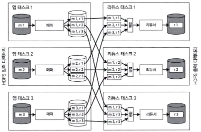

# 10장. 일괄 처리

## 유닉스 도구로 일괄 처리하기

---

- 일괄 처리(batch processing)는 대량 데이터를 한꺼번에 읽고, 변환하고, 집계하는 작업 방식
- HTTP/REST 기반 요청/응답 처리 방식과 달리, 비실시간·지연 허용 환경에서 작업함
- 단순한 도구 조합으로도 큰 데이터를 처리할 수 있음 — 특히 로그 분석 등에서 유용
- ex> nginx 로그를 `awk`, `sort`, `uniq` 등 유닉스 도구로 순차 파이프 처리해 가장 많이 요청된 URL 추출

> 유닉스 철학을 이용하면 복잡한 시스템 없이도 강력한 데이터 분석 파이프라인 구성 가능
> 

### 단순 로그 분석

---

- nginx access 로그를 대상으로 특정 필드(URL) 추출 → 빈도수 계산 → 상위 N개 출력
- 사용 도구 조합 ex>
    
    ```bash
    cat access.log |
    awk '{print $7}' |
    sort |
    uniq -c |
    sort -rn |
    head -n 5
    ```
    
    - 결과: 요청 URL top5를 한 줄 명령으로 추출
- 같은 작업을 루비/Python 등으로 구현할 수도 있지만, 유닉스 파이프라인이 더 간결
- 메모리 기반 해시 테이블 방식 vs 스트림 기반 유닉스 도구 방식 비교 설명
    - 해시 테이블 방식: URL을 전부 메모리에 저장해 카운트
    - 스트림 방식: 파이프 기반으로 한 줄씩 처리해 메모리 사용 최소화
- 유닉스 도구의 장점: 빠른 프로토타이핑, 반복/파이프 처리 최적화, 쉬운 확장

### 유닉스 철학

---

- 유닉스 철학의 중심 아이디어: 작고 단순한 프로그램을 조합해 문제 해결
- 주요 원칙:
    1. 한 프로그램은 한 가지 일에 집중하고 잘 수행하라
    2. 작은 도구들을 파이프로 연결하여 복잡한 작업 처리
    3. 텍스트 기반 인터페이스로 입출력 표준화(`stdin`/`stdout`)
    4. 결합도 낮음(loose coupling), 늦은 바인딩(late binding), 제어 역전
- 유닉스 도구(`awk`, `grep`, `sort`, `uniq`, `xargs` 등)는 데이터 스트림을 기반으로 동작
- 로그 파일뿐 아니라 파이프라인 처리, 운영 툴링(DevOps), 대규모 데이터 분석에 큰 영향
- 제대로 설계된 유닉스 도구는 단일 머신에서 탁월하지만 그 제약 때문에 Hadoop·MapReduce 같은 분산 일괄 처리 시스템이 등장함

## 맵리듀스와 분산 파일 시스템

---

- 맵리듀스는 유닉스 철학(모듈 조합)과 비슷하지만, 수백~수천 대 서버에서 병렬 처리가 가능하도록 설계된 시스템
- 유닉스 도구처럼 입력을 여러 조각으로 분할하고, 각 조각을 독립적으로 처리한 뒤 결과를 합침(reduce)
- 맵리듀스는 데이터가 저장된 위치에서 작업 수행(data locality)하여 대규모 데이터 처리에 적합
- 분산 파일 시스템과 함께 동작 (ex> HDFS)
    - 데이터를 여러 서버에 분산 저장
    - 장애 허용(Fault tolerant): 데이터 복제(Replica) 기반
    - 일반 머신으로 구성 가능 (Commodity hardware)
- 왜 분산 파일 시스템이 필요한가?
    - 처리할 데이터가 너무 커서 단일 서버로 감당 불가
    - 네트워크 비용을 줄이기 위해 “데이터가 있는 곳에서 연산”

> 핵심: “데이터를 옮기지 말고, 연산을 데이터가 있는 곳으로 가져가라”
> 

### 맵리듀스 작업 실행하기

---

- 맵리듀스는 보통 4단계로 구성됨:
    
    
    | 단계 | 설명 |
    | --- | --- |
    | 1. 입력 분할 | 입력 파일을 여러 조각(chunk)으로 나눔 |
    | 2. 맵(Map) | 각 조각에서 key-value 형태로 변환 |
    | 3. 셔플(Sort & Shuffle) | key 기준으로 정렬 및 재분배 |
    | 4. 리듀스(Reduce) | 같은 key 값들을 모아 최종 결과 생성 |
- 간단 예시: 웹 로그에서 가장 인기 있는 페이지 찾기
    1. 로그 파일 읽기
    2. URL을 key로 추출
    3. URL 기준으로 정렬
    4. 같은 URL 카운트를 합산해 가장 많이 요청된 URL 출력
    
    → 유닉스 파이프라인으로 하던 분석을 분산 환경에서 자동 수행
    

| 역할 | 설명 |
| --- | --- |
| Mapper | 데이터를 key-value 쌍으로 변환 |
| Reducer | 동일 key 그룹의 value를 합산/집계 |
- 설계 원칙
    - 작업은 데이터 단위로 독립 수행
    - 장애 시 해당 작업만 재실행
    - 처리량 확장: 노드 수를 늘려 성능 수평 확장 가능(Scale-out)

- 맵리듀스의 분산 실행
    - 맵리듀스는 여러 노드에서 병렬로 작업을 수행함.
    - 유닉스 파이프라인과 유사하지만,
        - 단일 장비에서 실행되는 유닉스 스크립트와 달리
        - 맵리듀스는 수백~수천 대 노드에서 작업 병렬 처리
    - 방식
        
        
        
        그림 10-1. 매퍼 3개와 리듀서 3개로 구성된 맵리듀스 작업
        
        - 각 입력 파일 또는 파일 블록을 각 노드의 메퍼(Map task)가 처리
        - Mapper 출력은 Shuffle 과정을 거쳐 Reducer로 전달되지며
        - Reducer는 같은 key 데이터들을 집계하여 결과 생성
    - 특징
        
        
        | 항목 | 설명 |
        | --- | --- |
        | 데이터 지역성(Data locality) | 데이터를 가진 노드에서 작업 실행 → 네트워크 비용 최소화 |
        | 고장 복구 | 작업 중 일부 노드 실패 시, 해당 작업만 다른 노드에서 재실행 |
        | 병렬 확장성 | 노드 수 증가 = 처리 성능 증가 |
        | 정렬 및 셔플 비용 | 대규모 데이터 정렬/전송이 성능에 큰 영향 |
    - 매퍼와 리듀서의 실제 역할
        
        
        | 단계 | 역할 |
        | --- | --- |
        | Mapper | URL 등 key 값을 추출해 key-value 출력 |
        | Shuffle | key 기준으로 데이터 정렬 및 재배치 |
        | Reducer | 같은 key로 모인 데이터 집계 후 최종 결과 생성 |
    
    > 유닉스 도구 조합을 대규모 클러스터로 확장한 형태라고 보면 됨
    > 

- 맵리듀스 워크플로
    - 필요성
        - 단일 맵리듀스 작업만으로는 해결할 수 없는 문제 많음
            - ex> 로그에서 URL 수집 → 상위 1,000개 URL → 해당 URL에 대한 상세 분석 등
        - 그래서 여러 개의 맵리듀스 작업을 순차 또는 병렬로 연결하는 구조가 필요 → 워크플로(Workflow)
    - 워크플로 구성 방식
        - 한 맵리듀스 작업의 출력이 다음 작업의 입력이 됨
        - 입출력 데이터는 HDFS 같은 분산 파일 시스템을 사용
        - 중간 결과는 디스크에 저장되며 다음 작업이 이를 읽어 처리
    - ex>
        1. 로그에서 URL 추출 (Map)
        2. URL 등장 횟수 계산 (Reduce)
        3. 상위 1,000개 URL 저장
        4. 해당 URL 세부 데이터를 다른 데이터셋에서 조인
        5. 최종 보고서 생성
        
        → 각 단계가 하나의 맵리듀스 작업이며, 연결되어 전체 파이프라인 형성
        
    - 워크플로 스케줄러 툴
        - 분산 작업을 순차/병렬로 제어하기 위한 도구들:
        
        | 도구 | 설명 |
        | --- | --- |
        | Oozie | 하둡 기반 배치 스케줄러 |
        | Azkaban | LinkedIn 배치 워크플로 시스템 |
        | Airflow | 현대적 DAG 기반 워크플로 엔진 (Airbnb 개발) |
        | Luigi | Spotify 데이터 파이프라인 도구 |
        | Pinball | Pinterest의 워크플로 시스템 |
    - 특징
        - 각 단계가 성공해야 다음 단계 진행 (fault-tolerant)
        - 엄격한 순차 처리+병렬 처리 가능
        - 복잡한 데이터 파이프라인 관리에 필수

### 리듀스 사이드 조인과 그룹화

---

- 리듀스 단계에서 조인 수행
    - 입력 데이터를 키 값 기준으로 정렬 후, 동일 키를 가진 레코드들이 리듀서에 전달되며 조인이 수행됨
- 관계형 DB의 JOIN과 동일 역할
    - 외래 키(foreign key) 또는 문서 참조(document reference) 방식의 조인을 분산 환경에서 구현

- 특징
    - 입력 데이터 전체 스캔 필요 → 비용 큼
    - 서로 다른 소스의 대량 레코드를 병합할 때 사용 (ex> 로그 + 사용자 DB)
    - 네트워크 트래픽이 높지만 범용적이며 유연함

- 과정 요약
    1. Map 단계에서 조인 키 생성 및 레코드 유형(출처) 태깅
    2. Shuffle 로 키 기반 정렬 및 그룹화
    3. Reduce 단계에서 키 기반으로 레코드 병합
    4. 조인 결과 출력

- 사용자 활동 이벤트 분석 예제
    - 클릭 로그(이벤트 데이터) + 사용자 프로필 테이블 조인
        
        
        
        그림 10-2. 사용자 활동 이벤트 로그와 사용자 프로필 데이터베이스 간 조인
        
    - 동일 사용자 ID 기준으로 모든 이벤트와 사용자 정보를 매핑
        
        
        

- 장점
    - 다양한 스키마/포맷에 적용 가능
    - 데이터가 여러 노드에 분산되어 있어도 조인 수행 가능

- 단점
    - 전체 데이터를 네트워크로 이동 → 비용 및 지연 큼
    - 성능 최적화를 위한 파티셔닝, 정렬 고려 필요

### 맵 사이드 조인

---

- Map 단계에서 조인 처리
- 입력 파일이 미리 정렬되었거나, 작은 테이블을 메모리에 캐싱할 수 있을 때 사용

- 방식
    - Reduce-Side 조인 (기본)
        - 맵 → 셔플/정렬 → 리듀스
        - 대규모 데이터, 일반적인 방식
    - Map-Side 조인 (빠름)
        - 정렬된 데이터에 대해 맵 단계에서 바로 병합
        - 셔플 단계 생략 → 매우 빠름
    - 브로드캐스트(해시) 조인
        - 작은 테이블을 전체 노드에 복제(broadcast) 후 메모리 해시로 lookup
        - Spark, Hive, Impala 등에서 널리 사용

- 장점
    - 네트워크 비용 최소화
    - 속도 빠르고 효율적

- 단점
    - 한쪽 데이터셋이 작아야 함 (메모리 적재 가능해야)

### 일괄 처리 워크플로의 출력

---

| 구분 | OLTP | 일괄 처리 |
| --- | --- | --- |
| 목적 | 실시간 트랜잭션 처리 | 대량 데이터 집계·분석 |
| 결과 형태 | 즉각 반응, 단일 레코드 | 요약 보고서, 분석 결과, 통계·지표 |
| 사용 예 | 은행 거래, 웹 요청 | 로그 분석, 추천 시스템, ETL |

- 일괄 처리 출력 형태
    - 리포트/대시보드용 통계
    - 추천 결과 (ex> 사용자 → 후보 상품 목록)
    - 사용자 세그먼트 생성 (ex> VIP 사용자 그룹)
    - ETL 결과물 저장 (ex> 집계 테이블 생성)
    - 검색 인덱스 구축 (문서 → 검색 인덱스 변환)
    - 데이터 마트 업데이트

- 워크플로 도구
    - 스케줄러/오케스트레이션: Oozie, Airflow, Azkaban, Luigi, Pinball
    - 분산 파이프라인: Cascading, Crunch, Pig, Hive, FlumeJava

- 일괄 처리 결과는 DB insert가 아니라 새로운 데이터 구조를 만들어 분석·활용하는 데 목적
- OLTP처럼 즉시 반영하는 방식이 아니라 분석/집계 파이프라인 출력

### 하둡과 분산 데이터베이스의 비교

---

1. 기본 관점의 차이
    - 하둡(MapReduce + HDFS)
        - 분산 파일 시스템 위에서 동작하는 범용 일괄 처리 프레임워크
        - 데이터 모델·스키마·질의 언어에 대한 제약이 거의 없음
        - “데이터를 먼저 저장하고, 해석은 나중에” 하는 접근이 가능
        - 운영체제에 가까운 범용 처리 플랫폼 성격
    - MPP 데이터베이스
        - 클러스터 장비 위에서 **분석 SQL 질의**를 병렬 실행하는 데 최적화
        - 저장 구조, 질의 계획, 실행 엔진이 긴밀하게 통합된 단일 시스템
        - 스키마 설계와 데이터 모델링을 사전에 정교하게 해야 함

1. 저장소의 다양성 (Schema-on-read)
    - 하둡(HDFS)은 단순한 바이트 파일 저장소
        - 텍스트, 이미지, 로그, 센서 데이터, 희소 행렬 등 형식 무관
    - 데이터 모델을 저장 시점이 아니라 읽는 시점에 결정
    - 이 접근은 데이터 웨어하우스의 중앙 집중식 스키마 설계보다 데이터 수집 속도를 크게 높임
        - 이질적인 데이터셋을 나중에 조인 가능하게 만듦
    
    → 데이터 레이크(data lake), 엔터프라이즈 데이터 허브 개념의 기반
    

1. ETL과 역할 분리
    - 하둡은 ETL 파이프라인에서 자주 사용됨
        1. 트랜잭션 시스템 → 원시 데이터 형태로 HDFS에 덤프
        2. 맵리듀스로 정제·변환
        3. 분석용 MPP 데이터 웨어하우스로 적재
    - 데이터 수집과 데이터 모델링을 분리함으로써
        - 조직 간 책임 분리가 쉬워짐
        - 다양한 분석 목적을 나중에 수용 가능

1. 처리 모델의 다양성
    - MPP DB
        - SQL 중심
        - 특정 분석 유형에 대해 매우 빠름
        - 하지만 머신러닝, 추천, 검색, 이미지 처리에는 부적합
    - 하둡 + 맵리듀스
        - 코드 기반 처리 가능
        - 대용량 데이터셋에서 다양한 알고리즘 실행 가능
        - SQL로 표현하기 어려운 처리에 유리

1. 결함 처리(fault tolerance) 설계 차이
    - MPP DB
        - 질의 중 노드 하나라도 죽으면 전체 질의 중단
        - 재시도 비용이 비교적 낮은 짧은 질의에 적합
        - 메모리 기반 처리 선호
    - 맵리듀스
        - 태스크 단위 실패 허용
        - 실패한 태스크만 재실행
        - 중간 결과를 디스크(HDFS)에 기록 → 내결함성 확보

## 맵리듀스를 넘어

---

1. 맵리듀스의 한계 인식
    - 모든 단계 사이에 정렬(sort) 이 강제됨
    - 중간 결과를 항상 HDFS에 기록 → I/O 비용 큼
    - 반복 처리, 그래프 처리, 스트리밍에 부적합
    - 직접 API로 복잡한 로직 구현이 어려움

1. 고수준 프로그래밍 모델의 등장
    - 맵리듀스 위에 추상화 계층 등장
        - Pig
        - Hive
        - Cascading
    - 장점
        - 생산성 향상
        - 맵/리듀스 내부 동작을 이해하면 최적화 가능

1. 새로운 처리 엔진의 등장
    - 데이터플로 엔진(Dataflow Engine) 개념
        - Spark
        - Tez
        - Flink
    - 특징
        - 작업 전체를 하나의 DAG로 표현
        - 단계 간 파이프라이닝 가능
        - 불필요한 정렬·디스크 기록 최소화

### 중간 상태 구체화

---

1. 맵리듀스의 구체화 방식
    - 각 작업 단계의 출력은 분산 파일 시스템(HDFS)에 **완전히 기록**
    - 장점
        - 강력한 내결함성
        - 재실행 용이
    - 단점
        - 전체 워크플로 지연 증가
        - 불필요한 디스크·네트워크 I/O

1. 유닉스 파이프라인과의 비교
    - 유닉스 파이프
        - 출력이 즉시 다음 단계 입력으로 스트리밍
        - 최소한의 중간 상태
    - 맵리듀스
        - 모든 선행 작업 완료 후 다음 단계 시작
        - 느린 태스크 하나가 전체 지연 유발

1. 데이터플로 엔진의 접근
    - 중간 상태를 메모리/로컬 디스크, 필요할 때만 HDFS에 저장
    - 연산자 간 스트리밍 가능
    - 전체 입력을 기다리지 않고 처리 시작 가능
    
    → 성능 대폭 개선
    

1. 내결함성과 재계산
    - 중간 상태를 줄이면 내결함성 문제가 발생
    - 해결 방법
        - Spark: RDD lineage(연산 계보)로 재계산
        - Flink: 연산자 상태를 체크포인트로 저장
    - 중요한 설계 포인트
        - 연산이 **결정적**(deterministic) 이어야 함
        - 비결정적 연산은 장애 복구 시 큰 문제

1. 언제 구체화가 더 나은가?
    - 중간 데이터가 매우 작을 때
    - 연산이 CPU 집약적일 때
    - 재계산 비용이 매우 클 때
    
    → “항상 스트리밍이 정답은 아니다”
    

### 그래프와 반복 처리

---

- 그래프 데이터 모델에서는 정점/간선을 순회하는 질의로 관계를 따라가며 필요한 결과를 찾음
    - 간선 따라가기, 정점 탐색
- OLTP에서는 “조건을 만족하는 소수 정점을 빠르게 찾는” 관점이 중요하지만, 일괄 처리에서는 그래프 전체를 오프라인으로 처리/분석하는 수요가 커짐
    - 추천/랭킹/머신러닝 등
- ex> 페이지랭크(PageRank): 링크 구조를 기반으로 웹페이지 “중요도”를 계산해 검색 결과 순서 결정 등에 활용.
- 스파크/플링크/테즈 같은 데이터플로 엔진은 작업을 DAG(방향 비순환 그래프) 로 표현하지만, 이는 “연산자/데이터 흐름” 그래프이고 그래프 처리에서의 그래프(데이터 자체가 정점·간선) 와는 의미가 달라 혼동 주의

- 많은 그래프 알고리즘은 “정점 + 인접 정점” 사이에서 값을 전파하며 수렴/종료 조건까지 반복(iterative) 하는 형태
    - ex> 간선을 반복적으로 따라가 도달 가능 관계를 확장하는 이행적 폐쇄같은 패턴.
- 맵리듀스는 기본적으로 “한 번 읽고 한 번 쓰는” 구조라 ‘끝날 때까지 반복’ 을 자연스럽게 표현하기 어렵고,
    - 보통 **외부 스케줄러**가 “1단계 실행 → 종료조건 확인 → 다음 반복”을 루프로 돌림.
    - 이 방식은 매 반복마다 **전체 입력을 다시 읽고 전체 출력을 다시 생성** → 비효율적
- 반복 그래프 계산을 위해 널리 쓰이는 모델이 벌크 동기식 병렬(BSP), 그 대표가 Pregel(지라프/Giraph, GraphX, Gelly 등).
    - 정점이 **메시지 전달**로 통신하며,
    - 반복 사이에 정점의 **상태를 유지**해서 “새로 도착한 메시지/변경된 부분” 중심으로 처리 가능.

## 정리

---

- 일괄 처리 프레임워크는 유닉스 도구 철학처럼 “작은 연산을 조합해 큰 문제를 푼다”는 접근을 계승해 왔음.
- 분산 일괄 처리에서 핵심 과제는 크게 2가지:
    - **파티셔닝**: 관련 데이터(같은 키 등)를 한곳으로 모아 조인/그룹화/집계를 가능하게 함.
    - **내결함성**: 장애가 나도 결과를 다시 만들 수 있도록 재시도/복구 메커니즘을 제공.
- 맵리듀스 이후 데이터플로 엔진들은 필요 없으면 정렬을 생략하는 등 최적화를 하면서도, 결국 파티셔닝 + 내결함성 문제를 계속 다루는 구조
- 일괄 처리의 중요한 특징:
    - 입력을 직접 바꾸지 않고 **입력을 읽어 파생 출력을 생성**함(출력은 입력의 함수).
    - 입력이 **유한한 데이터(스냅샷/로그 파일 집합)** 라는 가정이 있어 작업이 종료될 수 있음.
- 반대로 스트림 처리에서는 입력이 무한히 들어올 수 있어(끝이 없음) 전제와 설계가 달라짐.
