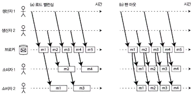

# 11장. 스트림 처리

## 이벤트 스트림 전송

---

- 스트림 처리: 일괄 처리(batch)와 달리, 스트림 처리는 데이터가 시간 흐름에 따라 지속적으로 발생할 때 사용
    - 시스템이 입력을 기다릴 필요 없이, 이벤트 발생 즉시 처리
    - 웹 클릭, IoT 센서 신호, CPU/메모리 지표, DB 변경 로그 등이 모두 이벤트가 될 수 있음

- 이벤트 특성
    - 특정 시점에 발생한 변화
    - 타임스탬프 포함(시간 기반 분석 가능)
    - DB에 직접 저장되거나, 중간 스트림 로그/큐를 통해 소비자에게 전달됨
    
    | 개념 | 설명 |
    | --- | --- |
    | Producer | 이벤트 생성자 (ex. 웹 서비스, 센서, 앱) |
    | Event / Record | 기록 단위 (immutable, time-stamped) |
    | Topic / Stream | 이벤트가 전달되는 논리적 채널 |
    | Consumer | 이벤트를 처리/저장하는 주체 |

- 이벤트 전달 방식 유형
    
    
    | 유형 | 설명 |
    | --- | --- |
    | 이벤트 로그 저장 | 이벤트를 로그/파일/DB에 저장, 나중에 재처리 가능 |
    | 실시간 처리 | 이벤트를 받는 즉시 소비자에게 push |
    | 비동기 전파 | 이벤트를 다른 서비스로 비동기 전파 |

### 메시징 시스템

---

- 메시징 시스템의 역할
    - 새 이벤트를 소비자에게 알려주는 메커니즘
    - 생산자 → 메시지 시스템 → 소비자
    - 일반적으로 Pub/Sub(발행/구독) 모델

- 시스템 설계 시 핵심 질문
    
    
    | 질문 | 의미 |
    | --- | --- |
    | consumer가 처리 속도가 느릴 때? | - 메시지 버리기, 버퍼링, 배압 적용하기
    백프레셔(흐름 제어, 생산자가 메시지를 더 보내지 못하게 막는다), 큐 overflow 처리, 메시지 유실/보류 |
    | consumer가 오프라인일 때? | 메시지 durability, replay 지원 여부 |

- 생산자에서 소비자로 메시지를 직접 전달하기
    
    
    | 방식 | 특징 | 장단점 |
    | --- | --- | --- |
    | 직접 메시징 (TCP/UDP, 웹훅) | producer → consumer 직접 | 빠르고 단순하지만 손실/재시도/순서 문제 |
    | Queue / Broker | 중간 저장소가 메시지를 보관 | 내결함성↑, 확장성↑ (Kafka, RabbitMQ, ActiveMQ, Redis Streams) |
    | Database polling | DB를 이벤트 저장소로 활용 | 트랜잭션 장점, latency↑ 폴링 비용 |

- 복수 소비자
    
    
    
    그림 11-1. (a) 로드 밸런싱: 여러 소비자가 하나의 토픽을 소비하는 작업을 공유 (b) 팬 아웃: 각 메시지를 복수 개의 소비자로 전달
    
    1. 로드 밸런싱 (work queue)
        - 각 메시지는 여러 consumer 중 하나만 처리
        - 작업을 여러 worker에 분산
            
            > One message → one consumer
            > 
        - ex> Kafka consumer group, RabbitMQ worker queue
    2. 팬아웃 (broadcast / pub-sub)
        - 모든 소비자에게 동일 메시지 전파
        - 알림 시스템, 로그 파이프라인 등
            
            > One message → many consumers
            > 
        - ex> SNS, Redis Pub/Sub, Kafka multi-subscription

- 확인 응답(Acknowledgments)과 재전송
    - 소비자가 메시지 처리 후 ACK
    - ACK 없으면 broker가 재전송
    - 장애 시 메시지 순서가 바뀔 수 있음
    - 완전한 순서 보장 위해 원자적 commit 로그, 펜싱 토큰, 멱등 처리 필요
    - 해결 기법:
        - 멱등 처리(Idempotent handlers)
        - 원자적 커밋 로그(ex> Kafka)
        - 펜싱 토큰(분산 시스템에서 리더 펜싱 기법)

### 파티셔닝된 로그

---

- 전통적인 메시징(JMS/AMQP) vs 로그 기반 브로커(Kafka 등)
    - 기존 메시지 큐: 메시지를 소비하면 큐에서 제거 (destructive consumption)
    - 로그 기반 시스템: 메시지는 삭제되지 않으며, append-only log로 영구 저장
        
        → 소비자는 offset을 이용해 처리 위치만 이동
        
    - 새로운 소비자도 과거 메시지 전체 재처리 가능 (replay)

- 파티셔닝(Partitioning)
    - 로그를 여러 파티션으로 나눠 저장 → 확장성 + 병렬 처리
    - 각 파티션은 append-only log
    - 메시지는 파티션 내 offset 순서로만 정렬
        - 파티션 내 순서 보장 (per-partition ordering)
        - 파티션 간 글로벌 순서 보장 ❌
    
    
    
    그림 11-3. 생산자가 메시지를 전송하면 메시지는 토픽 파티션 파일에 추가된다. 그러면 소비자는 순서대로 파티션 파일을 읽는다.
    

- 소비자 그룹
    - 하나의 파티션은 동시에 한 소비자만 처리
    - 소비자 장애 시 → 다른 소비자가 offset부터 이어서 처리
    - Kafka Consumer Offset = DB replication log offset과 유사
        
        (리더-팔로워 복제 방식과 개념적으로 동일)
        

- 장점
    - 영구 기록: 로그 유지 → 재처리 가능
    - 고성능: 디스크 Sequential Write, Zero-copy, OS page cache 활용
    - 확장성: 파티션 늘려 수평 확장
    - 장애 복구 용이: offset 기반 재처리

- 주의할 점
    - 느린 소비자: 디스크 공간 증가, retention 기간/용량 초과 시 데이터 손실
    - 순서 보장: 파티션 단위로만 순서 보장 (글로벌 순서 X)

- 대표 기술: Kafka, Amazon Kinesis, DistributedLog, Pulsar

## 데이터베이스와 스트림

---

| DB | Stream |
| --- | --- |
| 최종 상태 저장 (state) | 상태 변화 저장 (event log) |
| 최신 데이터만 표현 | 과거 + 실시간 이벤트 추적 |
| 트랜잭션 로그는 내부적 | CDC로 로그 외부 노출 가능 |

- CDC (Change Data Capture)
    - DB 트랜잭션 로그 → 외부로 스트림화
        
        → 검색 인덱스, 캐시, 데이터 웨어하우스 업데이트
        
- Event Sourcing
    - 이벤트 자체가 원본 데이터 (DB = 이벤트 로그)

| Event Sourcing | CDC |
| --- | --- |
| 이벤트가 truth | DB가 truth |
| 이벤트 저장 → 상태 재구성 | DB 로그 읽어 변경 스트림 |

### 시스템 동기화 유지하기

---

- 주기적으로 데이터베이스 전체를 덤프하는 작업이 너무 느리면 대안으로 사용하는 방법으로 이중 기록이 있다.

- 이중 기록(dual write) 문제
    
    
    
    그림 11-4. 데이터베이스에서 X를 먼저 A로 설정했다가 B로 바꿨다. 반면 색인에는 쓰기 요청이 반대 순서로 도착했다.
    
    - DB와 메시지 브로커에 동시에 기록 시:
        
        
        | 상황 | 문제 |
        | --- | --- |
        | DB 성공 + 브로커 실패 | 이벤트 유실 |
        | DB 실패 + 브로커 성공 | 잘못된 이벤트 발행 |
        | 순서 불일치 | 상태 불일치 발생 |
    - 해결 방식
        
        
        | 방법 | 설명 | 한계 |
        | --- | --- | --- |
        | 트랜잭션 로그 캡처
        (CDC) | DB 트랜잭션 로그 기반으로 이벤트 스트림 생성 | DB 스키마/엔진 종속 |
        | 아웃박스 패턴 | DB에 이벤트 저장(outbox) 테이블 두고 별도 프로세스가 브로커로 발행 | 운영 복잡도 증가 |
        | 단일 이벤트 저장소(Event Sourcing) | 이벤트가 곧 DB | 설계 난이도 높음 |

### 변경 데이터 캡처

---

- CDC: 데이터베이스에서 발생하는 변경(`INSERT`/`UPDATE`/`DELETE`)을 트랜잭션 로그 수준에서 캡처하여, 다른 시스템으로 동일한 순서로 스트리밍하는 기술
    
    
    
    그림 11-5. 데이터베이스에 쓰여진 순서대로 데이터를 가져와 다른 시스템에 변경 사항을 같은 순서로 적용한다.
    

- 특징??
    - DB 변경 기록(binlog/WAL/oplog)을 실시간 스트림으로 제공
    - 트랜잭션 순서 보존 → 파생 시스템(검색, 캐시 등) 일관성 유지
    - DB는 변경을 먼저 처리하고, CDC 소비자는 비동기적으로 따라감

- 변경 데이터 캡처의 구현
    
    
    | 방식 | 설명 |
    | --- | --- |
    | DB 로그 기반 복제
    (binlog, oplog) | MySQL binlog, MongoDB oplog 등 DB 내부 트랜잭션 로그 이용 |
    | 트리거 기반 저장 | DB 트리거로 변경 이벤트를 캡처해 별도 테이블/메시지로 기록 |
    | CDC 플랫폼 사용 | Debezium, Maxwell, GoldenGate 등 도구 활용 |
- 특징??
    - 비동기 방식으로 동작 (메시지 브로커와 유사)
    - 이벤트 순서를 유지하기 어려울 수 있음
    - CDC 로그 컴팩션 기능으로 과거 변경 누적으로 인한 저장소 압박 해결 가능
- 장점
    - 기존 DB 스키마 및 코드 변경 최소화
    - 이중 쓰기(dual write) 문제 없이 다른 시스템에 데이터 전달 가능
    - 실시간 ETL, 데이터 파이프라인 구축에 적합
- 사용 사례
    - DB 변경을 Kafka로 스트리밍 -> 검색 시스템(Elasticsearch), 캐시, 데이터 웨어하우스(BigQuery 등) 동기화

### 이벤트 소싱

---

- 데이터를 현재 값만 저장하는 것이 아니라, 상태 변화 이벤트 자체를 순서대로 저장
- 최종 상태는 이벤트 로그를 재생(replay)하여 구성
    - ex> 주문 상태가 paid → shipped → delivered로 바뀜
        
        → 최종 상태를 저장하지 않고 변화 과정인 이벤트 자체를 저장
        

| 항목 | 이벤트 소싱 | CDC |
| --- | --- | --- |
| 기록 단위 | 비즈니스 이벤트(도메인 의미) | DB row 변경 |
| 목적 | 도메인 모델 정밀 기록, 감사/추적 | 시스템 간 데이터 동기화 |
| 소비 시점 | 이벤트 발생 즉시 | DB 변경 후 |
- 특징
    - 이벤트는 시스템의 사실 기록(fact)
    - 이벤트 발생 시점에서는 취소·변경 불가 (append-only)
    - 시스템 장애 시 이벤트 로그 replay 통해 복구 가능
- 장점
    - 고도의 감사 및 감사 추적 가능 (감사 로그 역할)
    - 과거 상태 재구성 가능 (시간 여행 기능)
    - CQRS, 도메인 주도 설계(DDD)와 잘 어울림
- 주의점
    - 이벤트 스키마 버전 관리 필요 → 오래된 이벤트 처리 방식 고려해야 함
    - 이벤트 로그가 커지므로 스냅샷 사용 필요 가능

### 상태와 스트림 그리고 불변성

---

- 불변성은 입력 파일 처리 방식에서 중요하며, 원본 데이터(이벤트)를 손상시키지 않고 유지하는 개념
- 데이터베이스는 보통 “현재 상태”를 저장하지만, 스트림 관점은 상태를 만드는 모든 변화(이벤트) 기록이 필요함

| 개념 | 설명 |
| --- | --- |
| 상태(state) | 특정 시점의 결과 (현재 계좌 잔액, 현재 재고 수 등) |
| 스트림(stream) | 상태 변화를 일으킨 모든 이벤트 흐름 (입금 기록, 거래 내역 등) |
| 변경 로그(changelog) | 시간에 따라 발생한 모든 이벤트(변경 내역) 집합 |

- 불변 이벤트의 장점
    - 금융 시스템(장부) 등에서 오래전부터 사용되어온 방식
    - 감사(audit)와 문제 재현 가능
    - 시스템 오류 시 이전 이벤트 재처리로 상태 복원 가능
    - 다양한 분석 및 검증 용도에 활용

## 스트림 처리

---

- 핵심 목표
    - 데이터가 생성될 때마다 실시간으로 처리 (파일 배치 방식 ≠ 스트림 방식)
    - 데이터 소스: 사용자 행동 이벤트, 센서 이벤트, DB 변경 이벤트 등

- 스트림 처리 방식
    1. 직접 메시지 전송
    2. 메시지 브로커 활용(Kafka 등)
    3. 이벤트 로그 기반 처리 및 재처리 지원
    
    | 배치 처리 | 스트림 처리 |
    | --- | --- |
    | 시간 단위 모아 처리 | 이벤트 발생 즉시 처리 |
    | 지연 높은 분석 | 실시간 대응/알림 |
    | 단순 | 복잡하고 고가용성 필요 |

### 스트림 처리의 사용

---

- 사용 사례
    - 실시간 경고/모니터링: 장애 감지, 이상 탐지, 주문 실패 감지
    - 금융 거래 감시 (부정 거래 탐지)
    - 광고/추천 엔진의 실시간 반응
    - 실시간 데이터 파이프라인 구축

- CEP(Complex Event Processing)
    - 특정 복잡 패턴(이벤트 조합)을 실시간 탐지
    - ex>
        - 주가가 5분 동안 연속 상승 & 거래량 급증 → 트레이딩 신호
        - 여러 센서 값 조합 → 공장 설비 장애 알람

- 스트림 분석 도구 예시
    - Apache Storm, Samza, Flink, Spark Streaming
    - Cloud Dataflow, Azure Stream Analytics

- 윈도우(Window) 개념
    - 실시간 스트림에서 시간 단위로 데이터 묶어 분석
        - ex> 최근 5분 평균, 최근 1시간 합계

### 시간에 관한 추론

---

- 스트림 처리는 이벤트가 발생한 시간(event time)과 이벤트가 처리되는 시간(processing time)을 다뤄야 함
    - 분석 목적일 때는 “지난 5분 평균”과 같은 시간 윈도우(window) 개념을 활용

- 이벤트 시간 대 처리 시간
    
    
    
    그림 11-7. 처리 시간 기준으로 윈도우를 만들면 처리율의 변동 때문에 생기는 허상을 남긴다.
    
    | 구분 | 의미 | 특징 |
    | --- | --- | --- |
    | 이벤트 시간 (Event Time) | 이벤트가 실제로 발생한 시간 | 정확한 분석 가능, 지연(delay) 문제 발생 |
    | 처리 시간 (Processing Time) | 시스템이 이벤트를 처리한 시간 | 처리 단순, 시간 왜곡 발생 가능 |

- 타임스탬프 기준 이벤트 처리
    - 이벤트 도착 순서가 실제 발생 순서와 다를 수 있음 → 지연 이벤트(late event) 처리 필요.
    - 해결 전략:
        1. 윈도우 닫기를 지연 (late event 수용)
        2. 완료된 윈도우에 대한 별도 보정 처리 (retraction, correction)

- 윈도우 유형
    
    
    | 윈도우 유형 | 설명 |
    | --- | --- |
    | Tumbling Window | 고정된 간격, 겹치지 않음 |
    | Hopping Window | 고정 간격 + 겹침 가능 |
    | Sliding Window | 이벤트 기반으로 유동적 이동 |
    | Session Window | 사용자 세션 기반, 비활동 시간 기준 종료 |
    
    ❗시간은 스트림 처리의 본질이며, 지연/순서 뒤바뀜/네트워크 변동에 대비하는 설계가 필수
    

### 스트림 조인

---

- 스트림 조인: 스트림 간의 실시간 관계 분석
    
    
    | 조인 방식 | 설명 |
    | --- | --- |
    | 스트림-스트림 조인 | 두 이벤트 스트림을 시간 기준으로 조인 |
    | 스트림-테이블 조인 | 최신 상태 저장 테이블과 조인 (ex> 사용자 프로필) |
    | 테이블-테이블 조인 | 이벤트에 의해 지속 업데이트 되는 테이블 간 조인 |

- 상태 유지(State) 의 필요성
    - 조인은 상태(state) 를 유지해야 함
        - ex> ‘세션 ID’, ‘최근 클릭된 URL’, ‘사용자 프로필’ 등
    - 상태는 일정 기간 보관 → 윈도우 + state-store 활용

- 조인의 시간 의존성
    - 서로 다른 stream의 이벤트 발생 시점 불일치 문제
    - 데이터 웨어하우스의 SCD(slowly changing dimension) 문제와 유사
        
        → 특정 시점의 데이터를 정확히 복원해야 함
        

- ex> 사용자 클릭-검색 이벤트
    - 사용자가 검색하고 그 결과를 클릭 → 두 스트림 join
    - 늦게 도착한 클릭 이벤트도 반영해야 함
    - 중복, 늦게 도착, 순서 뒤바뀜 문제 처리 필요

### 내결함성

---

- 목표
    - 정확히 한 번 처리 semantics (exactly-once)
    - 장애 시 재처리되도 동일 결과 보장 (idempotence + checkpoint)
- 전략
    - 마이크로 배치 + 체크포인트
    - 원자적 커밋 + 재검토 (commit & verify)
    - 멱등성(idempotent) 처리
    - 장애 후 상태 재구축 (state replay & log restore)

## 정리

---

| 개념 | 핵심 요약 |
| --- | --- |
| CDC | DB 변경 이벤트 실시간 캡처·전달 |
| 이벤트 소싱 | 이벤트 전체 저장 → 상태 재구성 |
| 불변 로그 | 이벤트는 변하지 않음 → 감사를 위한 근거 |
| 스트림 처리 | 빠른 이벤트 소비·분석/처리 |
| 시간 문제 | 이벤트 시간 vs 처리 시간 → 윈도우 처리 |
| 스트림 조인 | 스트림 간/테이블과 결합 → 상태 유지 필요 |
| 내결함성 | exactly-once, checkpoint, 재처리/복구 |
